# CloudOps-Copilot

> [!IMPORTANT]
> CloudOps Incident Agent V3 的唯一规范来源是
> [`docs/CloudOps-Incident-Agent-V3-Refactor-Design.md`](docs/CloudOps-Incident-Agent-V3-Refactor-Design.md)。
> 本 README 其余内容描述审计时仍存在的 V2 实现与历史演示，只是迁移输入，不具有 V3 规范地位，也不能用于证明任何 V3 Gate 已通过。

> A Go-based cloud-native Incident Copilot for evidence-driven investigation, approval-bound remediation, and deterministic recovery verification.

CloudOps-Copilot（云原生 Incident Copilot）是一个以 Go 为核心、运行于 Kubernetes、围绕 Incident 构建的故障调查与受控恢复系统。它把 Signal、调查证据、诊断、审批、变更、恢复验证和复盘放进同一条可审计生命周期，而不是只生成一段运维建议。

当前成果用于秋招、源码讲解、项目演示和技术面试，是可重复运行的 **local disposable Demo**；项目达到 interview-ready，但不宣称 production-ready。

## 项目解决的问题

常见运维流程中，告警、诊断、变更和恢复验证分散在不同工具里：

- 告警只说明“发生了什么”，没有形成可追踪的故障对象；
- 普通 ChatOps 或 LLM Chatbot 可以给建议，却无法证明结论来自哪些真实证据；
- 自动化脚本可能直接执行写操作，缺少人工审批、范围约束和审计事实；
- Kubernetes API 返回成功，只能证明请求被接受，不能证明工作负载、告警和用户影响已经恢复。

CloudOps-Copilot 使用统一 Incident 串联整个过程，并规定只有 required Verification checks 全部通过后，Incident 才能进入 `RESOLVED`。

## 核心流程

```mermaid
flowchart LR
    Signal[Prometheus / Alertmanager Signal] --> Incident[Incident aggregation]
    Incident --> Agent[Durable bounded Agent]
    Agent --> Evidence[Evidence]
    Evidence --> Diagnosis[Evidence-bound Diagnosis]
    Diagnosis --> Plan[RemediationPlan]
    Plan --> Approval[Human Approval]
    Approval --> Change[Controlled Change]
    Change --> Verification[Deterministic Verification]
    Verification -->|required checks pass| Resolved[RESOLVED]
    Verification -->|fail or timeout| Agent
    Resolved --> Postmortem[Postmortem]
    Postmortem --> Workbench[Incident Workbench]
```



核心技术主线：

```text
Prometheus / Alertmanager Signal
-> Incident aggregation
-> durable Agent investigation
-> Evidence-bound Diagnosis
-> Approval-bound Remediation
-> controlled change
-> deterministic recovery Verification
-> Incident Workbench
```

## 核心能力

- **Incident aggregation**：标准化 Alertmanager firing/resolved Signal，并按确定性规则聚合 Incident。
- **Durable multi-step Agent**：基于 Eino Graph 运行有界调查，持久化 AgentRun、AgentStep、预算、lease、heartbeat 和 checkpoint。
- **Observation-driven loop**：Agent 根据工具 Observation 判断证据覆盖是否足够，不足时继续选择动作或 replan。
- **Evidence-bound Diagnosis**：诊断必须引用持久化 Evidence，校验无证据断言和越权结论。
- **Bounded tools**：Kubernetes、Prometheus、Runbook、GitHub、Argo CD、Registry 等能力通过 allowlist、超时、结果上限和脱敏边界调用。
- **Runbook RAG**：支持 BM25、可选 Embedding、RRF 与 reranker，为调查提供可追踪的 Runbook 上下文。
- **Approval-bound remediation**：RemediationPlan、patch hash、plan hash、actor 和 Approval 分离记录；模型不能自行获得审批或凭据。
- **Guarded Demo change**：本地 Demo 仅在 disposable kind、专用 namespace、受限 RBAC 和多重配置 guard 同时满足时执行受控 scale。
- **Deterministic Verification**：Kubernetes rollout、workload readiness 和 Alert resolved 等 required checks 独立判断恢复结果。
- **Postmortem**：只把经过 Evidence 和最终 Verification 支持的事实写入复盘。
- **Incident Workbench**：统一展示 Signal、Timeline、Agent、Evidence、Diagnosis、Remediation、Delivery、Verification 和 Postmortem。
- **Metrics / Logs / Traces**：保留 Prometheus、Alertmanager、Grafana、VictoriaMetrics、Fluent Bit、Elasticsearch、Kibana 和 Jaeger 展示能力。

## 技术架构

| 层次 | 技术与职责 |
| --- | --- |
| Backend | Go、Gin、GORM、Goose migrations、Eino Graph |
| Frontend | Vue 3、TypeScript、Vite、Element Plus |
| Durable state | MySQL |
| Cache / coordination | Redis |
| Event infrastructure | Kafka |
| Container / orchestration | Docker Compose、Kubernetes、kind、Helm |
| Metrics / alerts | Prometheus、Alertmanager、Grafana、VictoriaMetrics |
| Logs | structured JSON logs、Fluent Bit、Elasticsearch、Kibana |
| Traces | OpenTelemetry SDK、OTLP、Jaeger |
| Formal delivery adapters | GitHub、Registry、Argo CD、Delivery / Verification adapters（默认关闭） |
| Engineering | GitHub Actions、go test/vet/race、golangci-lint、ESLint、Vitest、promtool、shellcheck |

应用依赖方向：

```text
router / handler
-> application services
-> incident / agent / remediation / verification domains and ports
-> infrastructure adapters
-> MySQL / Redis / Kafka / Prometheus / Kubernetes / GitHub / Argo CD / Registry
```

## 快速演示

### 环境依赖

需要 Linux 或兼容容器环境，并安装：

```text
Docker + Docker Compose
kind
kubectl
Go
Helm
curl
jq
git
sed
awk
```

`shellcheck` 可选，但安装后会由 preflight 自动执行。建议预留约 8 GB 可用内存；首次运行需要拉取镜像。

### 一键运行

```bash
cd server-monitor
make demo-v2-check
make demo-v2
```

`make demo-v2` 通常约 100 秒完成，输出八个阶段以及 Incident、AgentRun、Evidence、RemediationPlan、ChangeRequest、VerificationRun、Postmortem ID，最终应看到：

```text
DEMO_STATUS=PASS
Final Incident state: RESOLVED
Verification required checks: deployment_rollout=PASSED,workload_ready=PASSED,alert_resolved=PASSED
Execution mode: CONTROLLED_DIRECT_LOCAL_DEMO
PRODUCTION_GITOPS_E2E_VALIDATED=NO
```

Workbench 地址会在结果中打印，格式为：

```text
http://127.0.0.1:18080/incidents/<incident-id>
```

安全清理：

```bash
make demo-v2-clean
```

脚本只操作 `cloudops-v2-demo` Compose project、`cloudops-demo` kind cluster、专用 namespace/workload 和对应 disposable kubeconfig，不清理无关 Docker/Kubernetes 资源。

历史 V2 Demo Guide 已从当前 HEAD 删除；当前行为边界和删除条件见 [V3 Architecture Baseline](docs/architecture.md)。

### 启动完整本地栈

如需同时查看 Grafana、VictoriaMetrics、ELK 和 Jaeger：

```bash
cd server-monitor
make env-init
make compose-up
```

`make compose-up` 会先等待 Compose MySQL 就绪，使用显式 Goose migration 应用 V2 `00001-00006`，再启动完整 14 服务栈。它不会用 GORM 隐式替代 V2 migration。

## 可观测能力

### Metrics / Alerts

```text
Application / Demo workload
-> Prometheus
-> Alertmanager
-> POST /api/v2/webhook/alertmanager
-> Signal / Incident / Workbench
```

Grafana 展示指标；Prometheus 通过 remote-write 把样本写入 VictoriaMetrics。

### Logs

```text
Container JSON logs
-> Fluent Bit
-> Elasticsearch
-> Kibana
```

server-web 日志包含 `service`、`instance`、`ts`、`level`、`msg`、request/trace identity 等字段。

### Traces

```text
server-web OpenTelemetry spans
-> OTLP
-> Jaeger
```

HTTP、Incident、Agent node、Agent tool、Remediation、Verification 等路径存在 Trace instrumentation。本地完整栈可查询 HTTP Trace；V2 Demo 可产生 Agent/Tool span。

### 本地入口

| 服务 | Compose 默认地址 |
| --- | --- |
| Incident Workbench | http://127.0.0.1:8080/incidents |
| Grafana | http://127.0.0.1:3000 |
| Prometheus | http://127.0.0.1:9090 |
| Alertmanager | http://127.0.0.1:9093 |
| VictoriaMetrics | http://127.0.0.1:8428 |
| Jaeger | http://127.0.0.1:16686 |
| Elasticsearch | http://127.0.0.1:9200 |
| Kibana | http://127.0.0.1:5601 |

历史 V2 Observability 文档已从当前 HEAD 删除；V3 观测目标只以 [V3 设计](docs/CloudOps-Incident-Agent-V3-Refactor-Design.md) 为准。

## 核心 Demo 与扩展可观测栈

核心 Demo 为控制时长只启动必要路径：

```text
Prometheus, Alertmanager, MySQL, Redis, Kafka, server-web, kind, Demo workload
```

Jaeger 也随 Demo 启动以保留 Trace 证据。完整 Compose 和 Helm 继续提供扩展展示能力：

```text
Grafana, VictoriaMetrics, Fluent Bit, Elasticsearch, Kibana, Jaeger
```

当前 Agent 核心调查主要消费 Incident、Kubernetes、Prometheus 和 Runbook Evidence。Elasticsearch/Kibana、Jaeger 和 VictoriaMetrics 目前主要用于可观测展示和人工排障；不要把它们描述成已完整接入 Agent 自动诊断的数据源。

## 项目结构

```text
CloudOps-Copilot/
├── README.md
├── docs/
│   ├── CloudOps-Incident-Agent-V3-Refactor-Design.md  # V3 唯一规范
│   ├── architecture.md
│   ├── migration-ledger.md
│   ├── risk-register.md
│   ├── adr/
│   └── evidence/
└── server-monitor/
    ├── server-web/                 # Incident API、Agent runtime、Remediation、Verification、Workbench
    ├── pkg/                        # logger、tracer、Kafka、config utilities 等共享 Go 包
    ├── frontend/                   # Vue 3 Incident Workbench
    ├── runbooks/                   # Runbook knowledge base
    ├── docker/                     # Prometheus、Alertmanager、Grafana、ELK、Jaeger 配置
    ├── charts/server-monitor/      # 完整展示型 Helm Chart
    ├── k8s/                        # raw Kubernetes manifests
    ├── scripts/run-v2-demo.sh      # disposable Demo orchestration
    ├── docker-compose.yml
    ├── docker-compose.fast-demo.yml
    └── Makefile
```

当前源码入口和迁移决策见 [V3 Architecture Baseline](docs/architecture.md)；已删除的 V2 code map/architecture 只保留在 Git 历史中。

## 已验证结果

截至 V2 Step 4，本地证据包括：

- Step 3 连续两次 `make demo-v2` 通过，分别约 100 秒和 96 秒；
- 每次 Demo 均产生 10 个 AgentStep，Incident 最终为 `RESOLVED`；
- `deployment_rollout`、`workload_ready`、`alert_resolved` 三个 required checks 全部通过；
- Go 两个 modules 的 test、vet、build、goimports、lint 和高风险包 race 通过；
- 前端 lint、typecheck、unit test、build 通过；
- Compose、Helm、Shell、Prometheus/Alertmanager 配置检查通过；
- Prometheus/Alertmanager Signal path、VictoriaMetrics remote-write/sample query、Fluent Bit→Elasticsearch 日志查询、Jaeger Trace query 已实际验证。

旧 Step 4 报告已从当前 HEAD 删除，且不得作为 V3 证据；当前 Phase 0 证据见 [Baseline Audit Report](docs/evidence/phase-0-baseline-audit-report.md)。

## 项目边界

- 当前结果是 **local disposable Demo**，不是生产部署证明。
- Demo 使用 guarded controlled direct execution；正式源码中的 GitHub、Registry、Argo CD 和 Delivery/Verification adapter 默认关闭。
- 未验证真实 GitHub → CI → Argo CD → Kubernetes production GitOps E2E。
- transactional outbox 表和事务边界存在，但 outbox relay、inbox、DLQ 未实现。
- Compose/Helm 中的可观测组件是学习和展示型单节点拓扑，不包含 HA、DR 或生产容量规划。
- 未验证多副本、性能容量、生产安全基线和真实云平台凭据链路。

这些边界不削弱项目作为秋招作品的目标：项目重点证明 Go 后端建模、持久化状态机、Agent 工程约束、云原生集成、可观测性和从告警到恢复验证的闭环设计。V3 产品边界见 [V3 设计](docs/CloudOps-Incident-Agent-V3-Refactor-Design.md)。

## 面试导航

| 想讲的主题 | 首选源码入口 |
| --- | --- |
| Signal 如何成为 Incident | `server-web/internal/handler/incidents.go`、`internal/service/incident` |
| Incident 状态机 | `server-web/internal/incident/state_machine.go` |
| Agent Graph 与循环 | `server-web/internal/agent/graph`、`internal/service/agentruntime` |
| AgentRun / Step / Evidence 持久化 | `server-web/internal/infra/incidentmysql/agent_runtime.go` |
| bounded tools / Runbook RAG | `server-web/internal/agent/tool`、`internal/agent/runbook` |
| Approval 与 Remediation | `server-web/internal/remediation`、`internal/service/remediation` |
| guarded Demo write | `server-web/internal/service/fastdemo`、`internal/infra/k8schange` |
| deterministic Verification | `server-web/internal/verification`、`internal/service/deliveryverification` |
| Workbench API / UI | `server-web/internal/handler/incident_workbench.go`、`frontend/src/views/incidents` |
| Metrics / logs / traces | `server-web/internal/middleware`、`pkg/logger`、`pkg/tracer`、`docker/` |

历史 V2 Interview Materials 已删除；只有对应 V3 Gate 与最终 DoD 真实通过后，才可使用 V3 设计中的项目表述。
