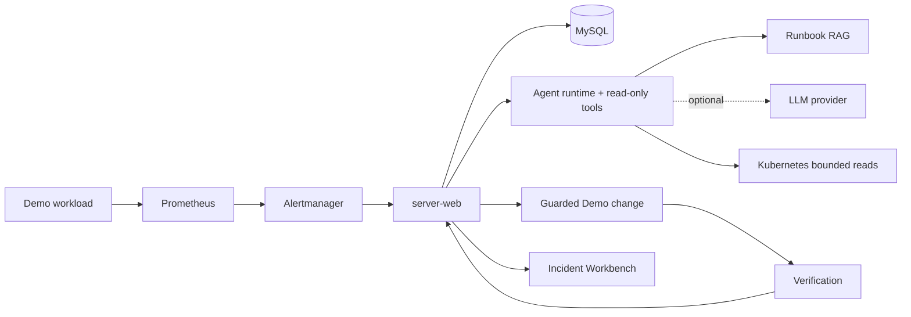

# CloudOps

## 项目概述

CloudOps 的核心项目位于 `server-monitor/`。当前 V2 是面向学习、秋招展示和本地演示的 Incident Agent 项目，不宣称生产就绪。

项目主线为：Signal → Incident → Agent Investigation → Evidence → Diagnosis → RemediationPlan → Approval → Controlled Change → Verification → Resolved → Postmortem → Incident Workbench。

适用场景：

- Go 后端、Agent runtime、持久化与云原生适配器的源码讲解
- 本地 disposable kind + Compose 的完整故障闭环演示
- Incident Workbench、审批边界和 Verification 约束展示

## 架构



## 项目目录

```text
server-monitor/
├── charts/server-monitor/    # Helm Chart
├── docker/                   # Compose、Prometheus、Grafana、Jaeger、Fluent Bit 等配置
├── docs/                     # 说明文档与辅助资料
├── frontend/                 # 前端工程
├── k8s/                      # 原始 Kubernetes 清单
├── pkg/                      # 共享 Go 包
├── runbooks/                 # Runbook 知识库
├── scripts/                  # 辅助脚本
├── server-web/               # Incident API、Agent runtime、Workbench 与 V2 服务
├── .env.example              # 本地配置参考
├── docker-compose.yml        # 本地编排入口
└── Makefile                  # 构建、测试、部署命令入口
```

补充说明：

- `server-web/internal/` 以 incident、agent、remediation、verification、infra 和 compatibility 边界组织。
- `docker/` 目录维护 Prometheus、AlertManager、Grafana、Jaeger、Fluent Bit、Elasticsearch 初始化等运行时配置。
- `charts/server-monitor/` 与 `k8s/` 分别提供 Helm 和原始清单两套集群部署入口。

## 快速开始

### V2 一键 Demo

```bash
cd server-monitor
make demo-v2-check
make demo-v2
```

`make demo-v2-clean` 只清理 `cloudops-v2-demo` Compose 项目和 `cloudops-demo` kind 集群。

### 本地 Compose

```bash
cd server-monitor
make env-init
make compose-up
```

启动后可访问：

| 服务 | 地址 |
|------|------|
| 监控大屏 | http://localhost:8080 |
| Grafana | http://localhost:3000 |
| Prometheus | http://localhost:9090 |
| Alertmanager | http://localhost:9093 |
| Kibana | http://localhost:5601 |
| Jaeger | http://localhost:16686 |

默认登录信息：

| 服务 | 用户名 | 密码 |
|------|--------|------|
| 监控大屏 | `admin` | `server-monitor-local-admin` |
| Grafana | `admin` | `server-monitor-local-grafana` |

说明：

- `.env.example` 提供完整本地配置参考，复制后按需修改 `.env` 即可。
- 如果需要启用 LLM 或 Kubernetes 集成，请直接编辑 `.env`，具体项以 `.env.example` 为准。

### 本地开发

```bash
cd server-monitor
make frontend-install
make dev-deps
make dev-web
```

前端开发可另开一个终端：

```bash
cd server-monitor
make dev-frontend
```

开发模式约定：

- `make dev-deps` 启动 Redis、MySQL、Kafka、Prometheus、Alertmanager、Grafana 和 Jaeger。
- `make dev-web` 本地运行 `server-web`，使用适配本机端口的默认开发配置。
- `make dev-stop` 停止 Compose 依赖服务。

### Helm / Kubernetes 部署

Helm 部署：

```bash
cd server-monitor
make helm-lint
make deploy-helm HELM_RELEASE=server-monitor KUBE_NAMESPACE=server-monitor
```

如果需要覆盖镜像、Secret 或其他 values，可追加 `HELM_SET_ARGS` 或直接替换 `HELM_VALUES`：

```bash
make deploy-helm \
  HELM_RELEASE=server-monitor \
  KUBE_NAMESPACE=server-monitor \
  HELM_SET_ARGS="--set serverWeb.image.repository=<repo>/server-web --set serverWeb.image.digest=sha256:<digest>"
```

生产发布应为三个应用镜像分别提供不可变 `sha256` digest；`image.tag` 仅作为本地兼容回退。Chart 的 `values.schema.json` 会拒绝格式无效的 digest。

原始清单部署：

```bash
cd server-monitor
make deploy-k8s
```

### 本地启用 K8s 集成（可选）

```bash
cd server-monitor
make k8s-setup
```

这会创建/检查 kind 集群、准备测试资源并生成本机 `docker/kubeconfig`。该文件含本地集群凭据、已被 Git 忽略，不得提交。完成后按 `.env.example` 调整 `.env` 中的 K8s 相关开关，再重新启动 `server-web` 或整套 Compose 服务。

## Makefile 常用命令

以下命令都在 `server-monitor/` 目录执行。

### 构建

| 命令 | 说明 |
|------|------|
| `make build` | 构建所有 Go 服务和前端资源 |
| `make build-go` | 构建所有 Go 服务 |
| `make build-server-web` | 构建 `server-web` |
| `make build-frontend` | 构建前端资源 |

### 测试与校验

| 命令 | 说明 |
|------|------|
| `make test` | 运行 Go 测试和前端类型检查 |
| `make test-go` | 运行所有 Go 模块测试 |
| `make test-k8s` | 运行 `server-web` 中的 K8s 相关测试 |
| `make test-frontend` | 运行前端类型检查 |
| `make vet` | 运行所有 Go vet |
| `make lint` | 运行 Go lint 和前端 ESLint |
| `make check-goimports` | 检查 Go imports 是否规范 |
| `make fmt` | 使用 `go fmt` 格式化 Go 代码 |
| `make fmt-goimports` | 使用 `goimports` 格式化 Go 代码 |
| `make k8s-script-check` | 检查 `docker/setup-k8s.sh` 语法 |
| `make check` | 本地完整校验入口 |
| `make ci` | 对齐 CI 的本地校验入口 |

### 开发运行

| 命令 | 说明 |
|------|------|
| `make frontend-install` | 安装前端依赖 |
| `make dev-deps` | 启动本地开发依赖 |
| `make dev-web` | 本地运行 `server-web` |
| `make dev-frontend` | 启动前端开发服务器 |
| `make dev-stop` | 停止本地开发依赖 |

### Compose / 部署

| 命令 | 说明 |
|------|------|
| `make compose-config` | 展开并检查 Compose 配置 |
| `make compose-build` | 构建 Compose 镜像 |
| `make compose-up` | 启动 Compose 服务 |
| `make compose-down` | 停止 Compose 服务 |
| `make compose-ps` | 查看 Compose 服务状态 |
| `make compose-logs LOGS_SERVICE=server-web` | 查看日志 |
| `make compose-clean` | 停止并清理 Compose 数据卷 |
| `make helm-lint` | 校验 Helm Chart |
| `make helm-template` | 渲染 Helm 模板 |
| `make deploy-helm` | 使用 Helm 部署/升级 |
| `make undeploy-helm` | 卸载 Helm Release |
| `make deploy-k8s` | 使用原始清单部署 |
| `make undeploy-k8s` | 删除原始清单 |
| `make k8s-setup` | 准备本地 kind 集成环境 |
| `make k8s-teardown` | 删除本地 kind 集群 |
| `make clean` | 清理本地产物 |

兼容说明：旧的 `make docker-up`、`make docker-down`、`make docker-logs`、`make ci-check` 等命令仍可用，但 README 统一以新的标准命名为准。

## 配置与部署文件

| 路径 | 用途 |
|------|------|
| `server-monitor/.env.example` | 本地配置参考 |
| `server-monitor/docker-compose.yml` | 本地 Compose 编排入口 |
| `server-monitor/docker/` | Prometheus、Alertmanager、Grafana、Jaeger、Fluent Bit、Elasticsearch 初始化等配置 |
| `server-monitor/charts/server-monitor/values.yaml` | Helm 默认 values |
| `server-monitor/k8s/` | 原始 Kubernetes 清单 |
| `server-monitor/docker/setup-k8s.sh` | 本地 kind 集成环境准备脚本 |

## 服务端口

| 服务 | 端口 | 说明 |
|------|------|------|
| `server-web` | `8080` | API、WebSocket、内置静态资源 |
| `Grafana` | `3000` | 监控大盘 |
| `Redis` | `6379` | 缓存与 Pub/Sub |
| `VictoriaMetrics` | `8428` | 长期指标存储 |
| `Prometheus` | `9090` | 指标查询与规则加载 |
| `Kafka` | `9092` | 事件总线 |
| `Alertmanager` | `9093` | 告警管理 |
| `Jaeger` | `16686` | 链路追踪 UI |
| `Elasticsearch` | `9200` | 日志存储 |
| `Kibana` | `5601` | 日志查询 |

## CI

CI 定义位于 `.github/workflows/ci.yaml`，所有外部 Actions 均固定到经过官方仓库 release 核验的 40 位 commit SHA。当前流程覆盖：

- Go 模块矩阵检查：`goimports`、`golangci-lint`、uncached `go test`、race、`go vet`、`go build`
- `server-web` 的 Agent runtime、Runbook RAG、Remediation、Verification 与 Workbench 检查
- 前端 clean install、ESLint、strict typecheck、unit test 与 production build
- Compose、Shell、Workflow YAML/actionlint、Kubernetes YAML/kubeconform 校验
- Prometheus 规则校验
- Helm values schema、lint、template 与渲染清单校验
- Docker 镜像构建、OCI label、漏洞扫描和 SBOM 校验
- DockerHub commit-SHA 镜像、exact-digest Trivy/SBOM、provenance/SBOM attestations、OIDC keyless signing 与严格 Cosign verify（`push-images`，仅 pushed `v*` tag 且通过 `production` environment 后触发）
- 三服务验证通过后生成单一原子 digest manifest；可选 Helm 部署仅消费该 manifest 中的 repository 和 digest（`deploy`，仅 `v*` tag、`vars.DEPLOY_ENABLED == 'true'` 且受保护 `production` environment 通过后触发）

非生产 hosted supply-chain 验证定义于 `.github/workflows/hosted-supply-chain-validation.yaml`。它只有无输入的 `workflow_dispatch` 入口，并在 job 层拒绝非 `refs/heads/main` 的执行。该路径使用 `GITHUB_TOKEN` 写入独立的 `ghcr.io/<owner>/cloudops-copilot-validation-<service>` package，不读取 DockerHub、Kubernetes、Argo CD 或 production secrets，也没有 Helm/Kubernetes deploy job。

每个 validation tag 都包含 exact Git SHA、workflow run ID 和 run attempt。签名与验证只使用 Registry digest；验证同时限制 GitHub Actions issuer、repository、workflow 文件、workflow name、`refs/heads/main`、Git SHA 和 `workflow_dispatch` event，并导出 workflow metadata、OCI labels、SBOM/Trivy hashes、provenance/SBOM bundle、Cosign certificate claims 和 Rekor evidence。临时 GHCR package version 在证据生成后 best-effort 删除；清理结果单独写入 artifact，清理失败不会覆盖主 sign/verify Gate 的结果。GHCR 的未标记 referrer/retention 行为仍应由专用 validation package 的 retention policy 兜底。

该 hosted validation workflow 目前只完成本地静态实现与检查，尚未在 GitHub-hosted runner 上执行。运行前需要确认仓库允许 Actions 写入/删除上述专用 GHCR package，并保留 `packages: write`、`attestations: write` 与 `id-token: write` 的最小 job 权限；不得把 validation package 改为正式 release repository。
