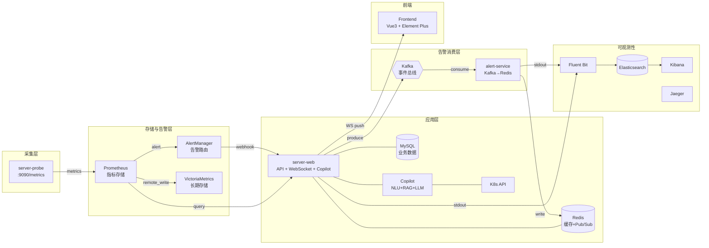

# CloudOps

## 项目概述

### 项目背景

CloudOps 是一个面向云原生环境的服务器监控与智能运维平台。传统监控方案往往需要组合多个独立工具，配置复杂、学习成本高，且缺乏端到端的实时告警推送和 AI 辅助能力。CloudOps 旨在提供一个从指标采集、存储、告警到 AI 辅助运维的完整学习项目，覆盖云原生监控体系的核心链路。

### 目标

- 实现「探针采集 → 指标存储 → 告警管理 → 实时推送 → 可视化展示」的完整闭环
- 集成 AI Copilot，支持自然语言查询、Runbook RAG 检索、告警诊断、Kubernetes 运维
- 提供告警规则管理、通知渠道配置、告警历史查询等告警生命周期管理
- 通过 WebSocket 实现告警和主机状态的实时推送
- 支持多用户认证与 RBAC 权限控制
- 提供 Docker Compose 一键部署和 Kubernetes/Helm 生产级部署两种形态

### 适用场景

- 云原生监控体系的端到端学习与参考
- 中小规模服务器集群的日常监控与告警
- 开发/测试环境的快速监控部署
- AI 辅助运维（AIOps）的实践与探索
- 需要自定义告警规则和通知渠道的运维团队
- Kubernetes 集群运维与告警诊断

### 核心链路

```
监控链路：server-probe → Prometheus → AlertManager → server-web webhook → Kafka → alert-service → Redis
AI 链路：  用户查询 → Copilot NLU → 工具执行/Runbook RAG/LLM → 自然语言回复
推送链路：  server-web → WebSocket → 前端大屏
日志链路：  server-probe/server-web/alert-service stdout → Fluent Bit → Elasticsearch → Kibana
```

## 核心功能

### 主机监控

- 自动发现并监控所有安装探针的主机
- 实时展示 CPU、内存、磁盘、网络、负载、进程等指标
- 支持主机在线/离线状态、风险等级（高 CPU / 高内存）筛选
- 主机分组管理，按业务维度组织主机
- 主机详情页支持 15m / 1h / 6h / 24h 时间范围的趋势图表

### 告警管理

- 接收 AlertManager Webhook 推送的告警事件
- 告警事件通过 Kafka 异步传递，alert-service 消费后写入 Redis
- 活跃告警查询，按严重级别（critical / warning / info）筛选
- 告警事件流，实时展示触发和恢复事件
- 告警历史分页查询，支持多条件筛选（状态、级别、名称、实例、时间范围）
- 告警规则 CRUD，支持 PromQL 表达式和 promtool 语法校验
- 告警规则同步到 Prometheus（渲染 YAML → 校验 → 写文件 → reload）

### 通知渠道

- 支持 Webhook 类型通知渠道
- 通知渠道 CRUD 管理
- 通知渠道连通性测试（发送测试请求并返回延迟和状态码）

### 实时推送

- WebSocket 连接 `/ws/alerts`，实时接收告警事件和主机列表更新
- 前端自动重连（指数退避策略，1s ~ 30s）
- 新告警到达时弹出 Toast 通知
- 页面标题动态更新告警数量

### 可视化大屏

- 基于 Vue 3 + Element Plus 的监控大屏
- 总览页：统计卡片 + 主机资源排名
- 主机列表页：搜索、状态筛选、排序、风险筛选
- 告警页：当前告警与历史告警 Tab 切换
- 系统状态页：健康检查、就绪检查、依赖状态、监控概览

### 认证与权限

- JWT Token 认证
- admin / viewer 两种角色
- 路由守卫保护，管理员页面仅 admin 可访问
- Token 版本校验，支持强制下线
- 操作审计日志记录

### AI Copilot

- 自然语言查询，Copilot 自动识别意图并调用对应工具
- NLU 意图分类：规则匹配优先，低置信度时回退到 LLM 分类
- 多意图识别：单条消息可同时触发多个工具调用
- 工具执行结果经 LLM 生成自然语言摘要
- 支持多轮对话，保留上下文历史

> **注意**：Copilot 入口默认开启，但 LLM 相关能力（分类、摘要、诊断）需要配置 `LLM_API_KEY`。未配置时，Copilot 仅支持规则匹配的只读工具查询，LLM 分类和摘要功能降级不可用。

### 告警诊断

- 告警触发后自动/手动触发诊断流程
- 诊断 Worker 消费 Kafka 告警事件，调用工具和 LLM 生成诊断报告
- 诊断报告包含告警上下文、相关指标、Runbook 建议
- 支持诊断反馈（有用/无用 + 评论），用于持续改进

> **注意**：自动诊断需要同时启用 `DIAGNOSIS_ENABLED=true` 和配置 `LLM_API_KEY`。Docker Compose 默认启用诊断但未配置 LLM Key，需在 `.env` 中设置 `LLM_API_KEY` 后诊断摘要才可正常生成。

### Kubernetes 运维

- 通过 Copilot 执行 K8s 资源查询（Pod、Deployment、Service、Event、Log）
- 支持审批后的写操作（如 Deployment 扩缩容）
- 动作审批流程：Copilot 建议 → 管理员审批 → 执行
- Namespace 级别的访问控制

### 审计日志

- 记录 Copilot 动作审批与执行的操作审计
- 管理员可查询审计日志
- 支持按操作类型、时间范围筛选

## 架构



## 技术栈

### 后端

| 技术 | 版本 | 用途 |
|------|------|------|
| Go | 1.26 | 后端开发语言 |
| Gin | v1.12.0 | HTTP 框架 |
| GORM | v1.25.12 | ORM |
| gopsutil | v3.24.5 | 系统指标采集 |
| gorilla/websocket | v1.5.4 | WebSocket |
| go-redis | v9.17.0 | Redis 客户端 |
| Sarama | v1.48.0 | Kafka 客户端 |
| Prometheus client_golang | v1.23.2 | 指标暴露 |
| OpenTelemetry | v1.43.0 | 链路追踪 |
| Zap | v1.27.0 | 结构化日志 |
| k8s.io/client-go | v0.36.0 | Kubernetes 客户端 |
| golang.org/x/crypto | v0.50.0 | 密码加密（bcrypt） |
| swaggo/swag | v1.16.6 | Swagger 文档生成 |

### 前端

| 技术 | 版本 | 用途 |
|------|------|------|
| Vue | 3.5.22 | 前端框架 |
| TypeScript | 5.9.3 | 类型安全 |
| Vite | 7.1.7 | 构建工具 |
| Element Plus | 2.14.0 | UI 组件库 |
| ECharts | 6.0.0 | 图表可视化 |
| Pinia | 3.0.4 | 状态管理 |
| Vue Router | 4.6.4 | 路由管理 |
| Axios | 1.15.2 | HTTP 客户端 |
| Sass | 1.99.0 | CSS 预处理器 |

### 数据库与中间件

| 技术 | 版本 | 用途 |
|------|------|------|
| Redis | 7 | 缓存 + Pub/Sub 广播 |
| MySQL | 8.0 | 业务数据存储 |
| Prometheus | v2.51.0 | 指标存储与查询 |
| VictoriaMetrics | v1.102.1 | 长期指标存储 |
| AlertManager | v0.27.0 | 告警路由与管理 |
| Kafka | 7.6.1 (KRaft) | 事件总线 |
| Elasticsearch | 8.13.0 | 日志存储 |
| Kibana | 8.13.0 | 日志查询 |
| Fluent Bit | 3.1.4 | 日志采集 |
| Grafana | 10.4.0 | 可视化大盘 |
| Jaeger | 2.17.0 | 链路追踪 |

### 开发与部署工具

| 工具 | 用途 |
|------|------|
| Docker / Docker Compose | 容器化部署 |
| Kubernetes | 生产级容器编排 |
| Helm | Kubernetes 包管理 |
| GitHub Actions | CI/CD |
| promtool | Prometheus 规则校验 |
| golangci-lint | Go 静态检查 |

## 安装与配置

### 环境要求

| 依赖 | 最低版本 |
|------|---------|
| Go | 1.26 |
| Node.js | 20 |
| Docker | 20.x |
| Docker Compose | v2 |

### 方式一：Docker Compose 一键部署

```bash
cd server-monitor
make docker-up
```

访问 http://localhost:8080 查看监控大屏。

默认账号：

| 服务 | 地址 | 用户名 | 密码 |
|------|------|--------|------|
| 监控大屏 | http://localhost:8080 | admin | server-monitor-local-admin |
| Grafana | http://localhost:3000 | admin | server-monitor-local-grafana |
| Kibana | http://localhost:5601 | — | — |

注意事项：

- 首次启动后 Prometheus 抓取和告警规则加载需要 15-30 秒
- Elasticsearch / Kibana 首次启动较慢，日志链路可查询前需等待服务健康
- Docker Compose 默认绑定 `127.0.0.1`，生产环境必须修改绑定地址和默认密码
- 生产环境必须通过环境变量覆盖 `JWT_SECRET`、`ADMIN_PASSWORD`、`REDIS_PASSWORD` 等敏感配置

### 方式二：开发模式

无需构建 Docker 镜像，改代码后秒级生效：

```bash
# 终端 1：启动依赖服务（含 Redis、MySQL、Kafka、Prometheus、AlertManager、Grafana、server-probe）
cd server-monitor
make dev-deps

# 终端 2：本地运行 server-web（需先启动 dev-deps）
make dev-web

# 终端 3：本地运行前端开发服务器
make dev-frontend
```

前端开发服务器访问 http://localhost:5173，Vite proxy 自动转发 API 和 WebSocket 到 server-web。

> **注意**：`make dev-web` 已内联本地开发所需的环境变量（JWT_SECRET、MySQL、Kafka 等）。如需自定义，请修改 Makefile 或在 shell 中显式导出环境变量后运行 `go run .`。`.env` 文件仅供 Docker Compose 使用，不会自动加载到本地开发进程。

停止开发依赖服务：

```bash
make dev-stop
```

### 方式三：Kubernetes / Helm 部署

```bash
# 使用 Helm Chart 部署
# 注意：Helm 默认镜像为 goproject-server-web:0.1.0 等，需要替换为实际可用的镜像仓库
helm install server-monitor server-monitor/charts/server-monitor \
  --namespace server-monitor --create-namespace \
  --set serverWeb.image.repository=05allan1213/server-web \
  --set serverWeb.image.tag=latest \
  --set alertService.image.repository=05allan1213/alert-service \
  --set alertService.image.tag=latest \
  --set serverProbe.image.repository=05allan1213/server-probe \
  --set serverProbe.image.tag=latest \
  --set secret.jwtSecret=<your-jwt-secret> \
  --set secret.adminPassword=<your-admin-password>

# 或使用原始清单（同样需要先推送镜像到集群可访问的仓库）
kubectl apply -f server-monitor/k8s/
```

验证部署：

```bash
kubectl get pods -n server-monitor
kubectl port-forward svc/server-web 8080:8080 -n server-monitor
```

### 配置文件说明

| 文件 | 用途 |
|------|------|
| `docker/prometheus.yml` | Prometheus 采集配置 |
| `docker/alerts.yml` | 内置告警规则 |
| `docker/custom-alerts.yml` | 自定义告警规则（可由 server-web 写入） |
| `docker/copilot-ai-quality-rules.yml` | Copilot AI 质量监控告警规则 |
| `docker/alertmanager.yml` | AlertManager 路由与接收器配置 |
| `docker/jaeger/jaeger.yaml` | Jaeger 链路追踪配置 |
| `docker/fluent-bit/fluent-bit.conf` | Fluent Bit 日志采集配置 |
| `docker/fluent-bit/parsers.conf` | Fluent Bit 日志解析器配置 |
| `docker/grafana/provisioning/` | Grafana 数据源和大盘自动加载 |
| `docker/grafana/dashboards/` | Grafana 预置大盘（监控总览、AI 质量、Kafka 链路追踪） |
| `docker/elasticsearch/` | Elasticsearch ILM 策略和索引模板 |
| `k8s/configmap.yaml` | Kubernetes ConfigMap（非敏感配置） |
| `k8s/secret.yaml` | Kubernetes Secret（敏感配置） |
| `charts/server-monitor/values.yaml` | Helm Chart 默认值 |
| `.env.example` | 环境变量完整参考 |

### 环境变量

环境变量可通过 `.env` 文件或系统环境变量设置。以下默认值以 Docker Compose 部署为准；部分变量在 Helm/K8s 部署或本地开发时默认值不同，已在说明中标注。完整参考见 `.env.example`。

#### Redis

| 变量 | 默认值 | 说明 |
|------|--------|------|
| `REDIS_ADDR` | `redis:6379` | Redis 连接地址 |
| `REDIS_PASSWORD` | `server-monitor-local-redis` | Redis 密码 |
| `REDIS_DB` | `0` | Redis 数据库编号 |

#### MySQL

| 变量 | 默认值 | 说明 |
|------|--------|------|
| `MYSQL_HOST` | `mysql` | MySQL 主机地址 |
| `MYSQL_PORT` | `3306` | MySQL 端口 |
| `MYSQL_DATABASE` | `server_monitor` | MySQL 数据库名 |
| `MYSQL_USER` | `server_monitor` | MySQL 用户名 |
| `MYSQL_PASSWORD` | `server-monitor-local-mysql` | MySQL 密码 |

#### Kafka

| 变量 | 默认值 | 说明 |
|------|--------|------|
| `KAFKA_BROKERS` | `kafka:9092` | Kafka Broker 地址列表 |
| `KAFKA_GROUP_ID` | `alert-service` | Kafka 消费者组 ID |

#### 鉴权与安全

| 变量 | 默认值 | 说明 |
|------|--------|------|
| `AUTH_ENABLED` | `true` | 是否启用鉴权 |
| `JWT_SECRET` | `server-monitor-local-dev-jwt-secret-change-me` | JWT 签名密钥（≥32 字节） |
| `JWT_EXPIRE_HOURS` | `24` | JWT 有效期（小时） |
| `ADMIN_PASSWORD` | `server-monitor-local-admin` | 初始管理员密码 |
| `CORS_ALLOWED_ORIGINS` | 空 | 允许跨域来源（逗号分隔） |

#### 限流

| 变量 | 默认值 | 说明 |
|------|--------|------|
| `RATE_LIMIT_ENABLED` | `true` | 是否启用 API 限流（Helm 默认 `true`，代码/.env.example 默认 `false`） |
| `RATE_LIMIT_REQUESTS` | `120` | 限流窗口内最大请求数 |
| `RATE_LIMIT_WINDOW_SECONDS` | `60` | 限流窗口长度（秒） |

#### Prometheus 与告警规则

| 变量 | 默认值 | 说明 |
|------|--------|------|
| `PROMETHEUS_URL` | `http://prometheus:9090` | Prometheus 地址 |
| `ALERT_RULES_FILE_PATH` | `/etc/server-monitor/rules/custom-alerts.yml` | 可写告警规则文件路径 |
| `ALERT_RULE_SYNC_ENABLED` | `true` | 是否启用规则同步 |
| `PROMTOOL_PATH` | `/usr/local/bin/promtool` | promtool 路径 |
| `REQUEST_TIMEOUT_SECONDS` | `5` | Prometheus 查询超时（秒） |

#### LLM 大模型

| 变量 | 默认值 | 说明 |
|------|--------|------|
| `LLM_API_KEY` | 空 | LLM API Key（留空则 Copilot LLM 功能不可用） |
| `LLM_API_URL` | `https://api.deepseek.com/v1/chat/completions` | OpenAI 兼容 Chat Completions 地址 |
| `LLM_MODEL` | `deepseek-chat` | LLM 模型名称 |
| `LLM_TIMEOUT_SECONDS` | `60` | LLM 请求超时（秒） |
| `LLM_MAX_TOKENS` | `2048` | 单次响应最大 token 数（Helm/.env.example 默认 `800`） |

#### Copilot 智能助手

| 变量 | 默认值 | 说明 |
|------|--------|------|
| `COPILOT_ENABLED` | `true` | 是否启用 Copilot |
| `COPILOT_TOOL_REGISTRY_ENABLED` | `true` | 是否启用工具执行路径 |
| `COPILOT_TOOLS_CLASSIFY_ENABLED` | `true` | 是否启用 LLM 辅助工具分类（Helm/.env.example 默认 `false`） |
| `COPILOT_MULTI_INTENT_ENABLED` | `true` | 是否启用多意图识别（Helm/.env.example 默认 `false`） |
| `COPILOT_SUMMARY_ENABLED` | `true` | 是否启用工具结果 LLM 摘要 |
| `COPILOT_CHAT_HISTORY_MAX_ROUNDS` | `10` | 历史对话轮数 |
| `COPILOT_SESSION_TTL_SECONDS` | `7200` | 会话 TTL（秒） |

#### Runbook 知识库与 Embedding

| 变量 | 默认值 | 说明 |
|------|--------|------|
| `RUNBOOK_DIR` | `/app/runbooks` | Runbook Markdown 文件目录 |
| `RUNBOOK_SEARCH_TOP_N` | `2` | 诊断注入的 Runbook 片段数量 |
| `RUNBOOK_BM25_WEIGHT` | `0.3` | BM25 文本检索权重（0-1） |
| `EMBEDDING_API_URL` | 空 | Embedding API 地址（留空则仅 BM25 检索） |
| `EMBEDDING_MODEL` | 空 | Embedding 模型名称 |
| `RERANKER_ENABLED` | `true` | 是否启用 Reranker 重排序（Helm/.env.example 默认 `false`） |

#### 告警自动诊断

| 变量 | 默认值 | 说明 |
|------|--------|------|
| `DIAGNOSIS_ENABLED` | `true` | 是否启用告警自动诊断（Helm/.env.example 默认 `false`） |
| `DIAGNOSIS_WORKER_COUNT` | `1` | 诊断 Worker 并发数量 |
| `DIAGNOSIS_TASK_TIMEOUT_SECONDS` | `120` | 单次诊断总超时（秒） |

#### 动作审批与执行

| 变量 | 默认值 | 说明 |
|------|--------|------|
| `ACTION_APPROVAL_ENABLED` | `true` | 是否启用动作审批 |
| `ACTION_EXECUTION_ENABLED` | `false` | 是否允许真实执行白名单动作 |
| `ACTION_MAX_REPLICAS` | `10` | scale_deployment 允许的最大副本数 |

#### 反馈

| 变量 | 默认值 | 说明 |
|------|--------|------|
| `FEEDBACK_ENABLED` | `true` | 是否启用用户反馈功能 |
| `FEEDBACK_COMMENT_MAX_LENGTH` | `500` | 反馈评论最大长度 |

#### Kubernetes 集成

| 变量 | 默认值 | 说明 |
|------|--------|------|
| `K8S_ENABLED` | `false` | 是否启用 K8s 只读工具 |
| `K8S_WRITE_ENABLED` | `false` | 是否启用审批后的 K8s 写操作 |
| `K8S_IN_CLUSTER` | `false` | 是否优先使用集群内 ServiceAccount（Helm/.env.example 默认 `true`） |
| `K8S_KUBECONFIG` | 空 | 本地模式使用的 kubeconfig 文件路径 |
| `K8S_ALLOWED_NAMESPACES` | `default` | 允许访问的 namespace 列表 |
| `K8S_DEFAULT_NAMESPACE` | `default` | 默认 namespace |

#### HTTP 服务器（server-web）

| 变量 | 默认值 | 说明 |
|------|--------|------|
| `LISTEN_ADDR` | `:8080` | HTTP 监听地址 |
| `GIN_MODE` | `release` | Gin 运行模式（debug / release） |
| `STATIC_DIR` | `/app/static` | 前端静态文件目录（Docker 镜像内置，留空则不提供静态文件服务） |
| `WS_MAX_CONNECTIONS` | `1000` | WebSocket 最大连接数 |

#### 缓存与广播

| 变量 | 默认值 | 说明 |
|------|--------|------|
| `HOSTS_BROADCAST_INTERVAL_SECONDS` | `5` | 主机列表 WebSocket 广播间隔（秒） |
| `HOSTS_CACHE_TTL_SECONDS` | `30` | 主机缓存 TTL（秒） |
| `DASHBOARD_OVERVIEW_TTL_SECONDS` | `10` | 总览缓存 TTL（秒） |

#### server-probe 监控探针

| 变量 | 默认值 | 说明 |
|------|--------|------|
| `METRICS_PATH` | `/metrics` | 指标暴露路径 |
| `SCRAPE_INTERVAL` | `5` | 采集间隔（秒） |
| `HOSTNAME` | 自动获取 | 探针标识主机名 |
| `HOST_PROC` | 空 | 宿主机 /proc 挂载路径 |
| `HOST_SYS` | 空 | 宿主机 /sys 挂载路径 |

#### 可观测性

| 变量 | 默认值 | 说明 |
|------|--------|------|
| `LOG_LEVEL` | `info` | 日志级别（debug / info / warn / error） |
| `TRACE_OTLP_ENDPOINT` | `jaeger:4317` | OTLP gRPC 端点 |
| `TRACE_SAMPLE_RATE` | `1.0` | 链路追踪采样率 [0, 1] |

## 使用方法

### 启动服务

```bash
# Docker Compose 一键启动
cd server-monitor
make docker-up

# 开发模式（三个终端）
make dev-deps
make dev-web
make dev-frontend
```

### 基本操作流程

1. **登录**：访问 http://localhost:8080，使用 `admin` / `server-monitor-local-admin` 登录
2. **查看总览**：首页展示主机总数、健康/离线主机数、活跃告警数、资源排名
3. **浏览主机**：进入主机列表页，按状态/风险/分组筛选，点击主机卡片查看详情
4. **查看告警**：进入告警页，查看当前活跃告警和历史告警事件
5. **管理规则**：管理员进入设置 → 告警规则，创建/编辑/删除规则，同步到 Prometheus
6. **配置通知**：管理员进入设置 → 通知渠道，创建 Webhook 渠道并测试连通性

### 常见功能演示

#### 创建告警规则

1. 进入 **设置 → 告警规则**
2. 填写规则名称、PromQL 表达式、持续时间、严重级别
3. 点击创建，规则保存到 MySQL
4. 点击 **同步规则**，规则渲染为 YAML 并写入 Prometheus，自动触发 reload

#### 测试通知渠道

1. 进入 **设置 → 通知渠道**
2. 填写名称、类型（webhook）、URL
3. 点击 **测试**，系统发送 HTTP 请求并返回状态码和延迟

#### 使用 AI Copilot

1. 点击页面右下角的 Copilot 图标打开聊天面板
2. 输入自然语言查询，例如：
   - "查看所有主机的 CPU 使用率"
   - "有哪些活跃的告警？"
   - "查看 default namespace 下的 Pod 状态"（需启用 K8s 集成）
3. Copilot 自动识别意图，调用对应工具，返回自然语言摘要

#### 告警诊断

1. 告警触发后，可在告警详情页点击 **诊断** 按钮手动触发
2. 若启用了自动诊断（`DIAGNOSIS_ENABLED=true`），告警会自动触发诊断
3. 诊断完成后，在 **诊断列表** 页查看诊断报告
4. 可对诊断报告提交反馈，帮助改进诊断质量

#### Kibana 日志查询

1. 访问 http://localhost:5601
2. 创建 Data View：`sm-logs-*`，时间字段选择 `@timestamp`
3. 按 `service: server-web` 或 `path: /healthz` 查询请求日志

## 项目结构

```
server-monitor/
├── server-probe/                  # 监控探针：采集 CPU/内存/磁盘/网络/负载/进程指标
│   ├── collector/                 # 采集器（CPU、Memory、Disk、Network、Load、Process）
│   ├── config/                    # 配置加载
│   └── Dockerfile
├── server-web/                    # Web 后端：API + WebSocket + Copilot + 静态文件托管
│   ├── internal/
│   │   ├── config/                # 配置加载
│   │   ├── handler/               # HTTP Handler（认证、主机、告警、规则、渠道、用户）
│   │   ├── middleware/            # 中间件（认证、RBAC、CORS、日志、指标、限流、恢复）
│   │   ├── model/                 # 数据模型（User、AlertRule、AlertHistory、Channel、HostGroup 等）
│   │   ├── router/                # 路由注册与依赖注入
│   │   ├── service/               # 业务逻辑层（auth、host、cache、alert）
│   │   ├── infra/                 # 基础设施层
│   │   │   ├── database/          # MySQL 连接与迁移
│   │   │   ├── prometheus/        # Prometheus 查询客户端
│   │   │   ├── pubsub/            # Redis Pub/Sub 订阅
│   │   │   ├── redis/             # Redis 客户端与缓存封装
│   │   │   ├── webhook/           # AlertManager Webhook 接收
│   │   │   └── websocket/         # WebSocket Hub
│   │   └── copilot/               # AI Copilot 模块
│   │       ├── action/            # 动作审批与执行
│   │       ├── context/           # 上下文管理
│   │       ├── diagnosis/         # 告警自动诊断
│   │       ├── feedback/          # 诊断反馈
│   │       ├── handler/           # Copilot HTTP Handler
│   │       ├── k8s/               # Kubernetes 集成（client、service、sanitize）
│   │       ├── llm/               # LLM 调用封装
│   │       ├── nlu/               # 自然语言理解（含 eval 评估）
│   │       ├── runbook/           # Runbook RAG 检索（BM25、向量搜索、混合检索、reranker）
│   │       ├── service/           # Copilot 核心服务（分类、执行、回复）
│   │       ├── session/           # 会话管理
│   │       ├── suggestion/        # 操作建议
│   │       ├── summary/           # LLM 摘要生成
│   │       └── tool/              # 工具注册与执行
│   ├── docs/                      # Swagger API 文档
│   └── Dockerfile
├── alert-service/                 # 告警事件消费服务：Kafka 消费 → 处理 → Redis 存储
│   ├── alert/                     # 告警处理器与存储
│   ├── config/                    # 配置加载
│   ├── health/                    # 健康检查
│   ├── metrics/                   # Prometheus 指标
│   ├── redis/                     # Redis 客户端
│   └── Dockerfile
├── frontend/                      # Vue 3 前端
│   ├── src/
│   │   ├── api/                   # API 请求封装
│   │   ├── components/            # 通用组件（common、copilot、diagnosis、host、layout）
│   │   ├── composables/           # 组合式函数（WebSocket）
│   │   ├── pages/                 # 页面组件
│   │   ├── router/                # Vue Router 路由配置
│   │   ├── stores/                # Pinia 状态管理
│   │   ├── styles/                # 样式文件
│   │   ├── types/                 # TypeScript 类型定义
│   │   └── utils/                 # 工具函数
│   ├── vite.config.ts             # Vite 配置（含 dev proxy）
│   └── package.json
├── pkg/                           # 共享库
│   ├── configutil/                # 配置校验与环境变量工具
│   ├── httpmiddleware/            # HTTP 中间件
│   ├── kafka/                     # Kafka 生产者/消费者
│   ├── logger/                    # Zap 结构化日志封装
│   ├── redis/                     # Redis 客户端封装
│   ├── shutdown/                  # 优雅关闭
│   └── tracer/                    # OpenTelemetry 链路追踪
├── runbooks/                      # 运维知识库（Markdown），用于 Copilot RAG 检索
├── scripts/                       # 运维脚本（AI 质量报告、反馈导出、LLM 工具验证）
├── docker/                        # Docker Compose 专用配置
│   ├── prometheus.yml             # Prometheus 采集配置
│   ├── alerts.yml                 # 内置告警规则
│   ├── custom-alerts.yml          # 自定义告警规则
│   ├── copilot-ai-quality-rules.yml # Copilot AI 质量监控规则
│   ├── alertmanager.yml           # AlertManager 配置
│   ├── jaeger/                    # Jaeger 配置
│   ├── fluent-bit/                # Fluent Bit 日志采集配置
│   ├── grafana/                   # Grafana 数据源、大盘 Provisioning
│   └── elasticsearch/             # ES ILM 策略与索引模板
├── k8s/                           # Kubernetes 原始清单
├── charts/server-monitor/         # Helm Chart
├── .env.example                   # 环境变量完整参考
├── docker-compose.yml             # Docker Compose 编排
└── Makefile                       # 常用命令
```

## Makefile 命令

| 命令 | 说明 |
|------|------|
| `make build` | 构建所有服务 |
| `make build-probe` | 构建 server-probe |
| `make build-web` | 构建 server-web |
| `make build-alert-service` | 构建 alert-service |
| `make dev-deps` | 启动依赖服务（Redis/MySQL/Kafka/Prometheus/AlertManager/Grafana/Probe） |
| `make dev-web` | 本地运行 server-web（需先启动 dev-deps） |
| `make dev-frontend` | 本地运行前端开发服务器（需先启动 dev-web） |
| `make dev-stop` | 停止开发依赖服务 |
| `make run-probe` | 运行 server-probe（需自行准备环境变量） |
| `make run-web` | 运行 server-web（需自行准备环境变量，推荐使用 `make dev-web`） |
| `make docker` | 构建 Docker 镜像 |
| `make docker-up` | 启动所有服务 |
| `make docker-down` | 停止所有服务 |
| `make docker-logs` | 查看服务日志 |
| `make docker-clean` | 停止并清理所有数据 |
| `make test` | 运行所有 Go 测试 |
| `make test-pkg` | 仅运行 pkg 测试 |
| `make fmt` | 格式化 Go 代码 |
| `make lint` | golangci-lint 静态检查 |
| `make tidy` | 整理 Go 依赖 |
| `make clean` | 清理构建产物 |

## 服务端口

| 服务 | 端口 | 说明 |
|------|------|------|
| server-web | 8080 | API + WebSocket + 前端 |
| server-probe | 8082 → 9090 | Prometheus 指标 |
| alert-service | 8081 | 告警消费服务 |
| Prometheus | 9090 | 指标存储 |
| AlertManager | 9093 | 告警管理 |
| Grafana | 3000 | 可视化大盘 |
| Redis | 6379 | 缓存 + Pub/Sub |
| MySQL | 3306 | 业务数据 |
| Kafka | 9092 | 事件总线 |
| Elasticsearch | 9200 | 日志存储 |
| Kibana | 5601 | 日志查询 |
| Jaeger | 16686 | 链路追踪 UI |
| Jaeger OTLP | 4317 / 4318 | 链路数据接收 |
| VictoriaMetrics | 8428 | 长期指标存储 |

## CI/CD

项目使用 GitHub Actions 进行持续集成，流水线定义在 `.github/workflows/ci.yaml`。

触发条件：push / PR 到 `main` 分支。

| Job | 说明 |
|-----|------|
| server-probe | goimports + go test + go vet |
| server-web | goimports + go test + go vet + NLU 评估 + RAG 评估 + NLU 多意图评估 |
| alert-service | goimports + go test + go vet |
| pkg | goimports + go test + go vet |
| frontend | npm ci + npm run build |
| prometheus | promtool check config + check rules + check AI quality rules |
| helm | helm lint |
| docker-build | 构建三个 Docker 镜像（依赖以上全部通过） |
| push-images | 推送镜像到 DockerHub（仅 main 分支 push 触发） |
