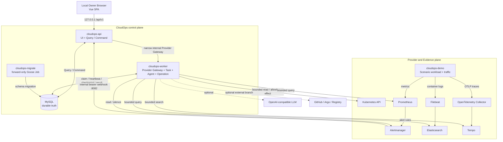
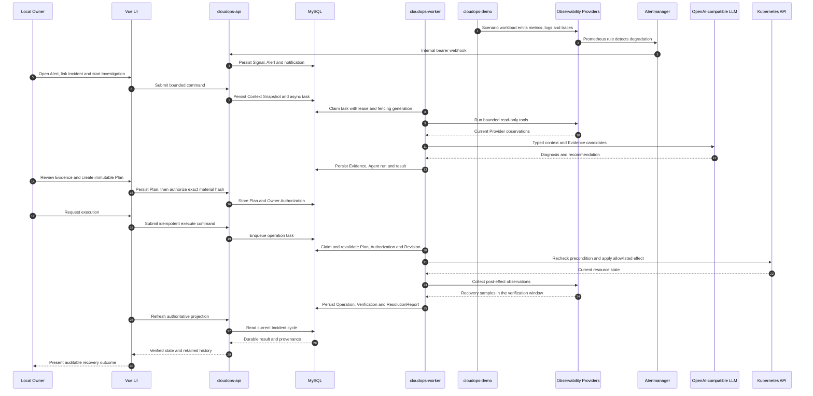

# CloudOps-Copilot

CloudOps-Copilot 是一个运行在本机 Kubernetes 上的证据驱动云原生运维平台，将 Kubernetes、Metrics、Alerts、Logs 和 Traces 汇聚为可追溯的 Evidence，并通过 Agent 辅助调查与 Owner 授权的受控操作，完成从 Observe 到 Verify 的运维闭环。

> [!IMPORTANT]
> 当前项目面向个人学习、技术演示与工程实践，仅支持 Linux 上的单 Local Owner，通过 `127.0.0.1` 访问本机 kind 集群中的 Helm release。它不是生产系统，不支持公网、LAN、多用户或无认证的远程部署。GitHub、Argo 和 Registry 属于可选外部集成，未配置或未实际执行时统一视为 `NOT RUN`。

## 项目介绍

这个项目关注的不是再做一组彼此独立的运维 Dashboard，而是让一次故障中的资源身份、绝对时间窗口、Provider 观测、Agent 判断、Owner 决策和最终操作能够相互引用并被复查。

前端提供 Overview、Infrastructure、Monitoring、Alerts、Logs、Traces、Agent、Incidents、DevOps 和 Settings 十个一级 Workspace，以及用于资源关联分析的 Operations Atlas。所有 Workspace 共享 `/api/v1`、Operational Scope、Context Link 和 MySQL 中的持久化领域对象：

- Kubernetes、Prometheus、Alertmanager、Elasticsearch 和 Tempo 保留各自的 Provider truth；
- 有界观测经过来源、时间、查询上下文和内容 Hash 标记后，才会进入 Evidence；
- Agent 只能基于显式上下文和只读工具进行调查或提出建议，模型输出本身不是 Evidence；
- Incident 串联 Investigation、Decision、Operation、Verification 和 ResolutionReport；
- 任何真实写操作都必须经过不可变 Plan、精确 Hash 授权和执行前 Provider precondition 重验。

## 核心能力

| 能力 | 当前实现 |
| --- | --- |
| 云原生基础设施 | 基于 Kubernetes API 展示 Cluster、Namespace、Workload、Pod、Service、事件与拓扑关系；Operational Scope 和绝对时间窗口贯穿页面跳转，Operations Atlas 提供资源关联视图。 |
| 监控 | 通过 Prometheus 提供 Metrics catalog、有界 PromQL 查询、查询历史、Query Definition 与 Query Authorization；前端使用 uPlot 展示指标，Grafana 作为本地辅助入口。 |
| 告警 | Alertmanager 通过集群内部 bearer webhook 写入 Signal/Alert；支持 Alert 列表与详情、acknowledge、限时 silence、Incident 关联和 Investigation 入口。 |
| 日志 | Filebeat 收集 Kubernetes 容器日志并写入 Elasticsearch；Logs Workspace 提供有界查询、历史记录、资源/时间上下文和持久化 Evidence。 |
| 链路追踪 | OpenTelemetry Collector 接收 OTLP 数据并写入 Tempo；Traces Workspace 提供 TraceQL 搜索、Trace 详情、Waterfall、Inspector 和 Evidence 留存。 |
| Agent | Worker 使用 CloudWeGo Eino 和 OpenAI-compatible Chat endpoint 执行持久化 Investigation/Consultation，结合 Kubernetes、Metrics、Logs 和 Traces 的只读工具生成可引用结论；LLM 凭据与模型通过 Settings 配置。 |
| DevOps | 以 immutable Operation Plan、exact-hash Authorization、异步执行和 post-effect Verification 约束变更；本地实际支持 Change Freeze 与 allowlisted Scenario Deployment scale，GitHub PR、Argo 和 Registry 为显式配置后才可使用的可选分支。 |

## 快速启动

### 运行要求

基础部署需要：

- Linux、GNU Make 与 Bash；
- 可用的 Docker daemon；
- kind、kubectl、Helm、jq、OpenSSL、Git、curl、`sha256sum`、`realpath` 和 `rg`；
- 至少 2 个 CPU core 和 2048 MiB 可用内存。

`make local-up` 会在 Docker 中构建前后端，因此基础部署不要求宿主机预装 Go、Node.js 或 npm。直接开发和运行测试时，版本以 `go.mod`、`frontend/package-lock.json` 与 CI 配置为准。

### 1. 基础本地部署

在仓库根目录运行：

```bash
make local-up
```

该命令会创建或复用固定的 `cloudops-local` kind 集群，构建并加载 API、Worker、Migrate 和 Demo 镜像，通过 Helm reconcile `cloudops-system/cloudops`，执行 forward-only migration，等待 MySQL 与观测组件就绪，并建立 loopback port-forward。

| 入口 | 默认地址 |
| --- | --- |
| CloudOps | `http://127.0.0.1:18080` |
| Grafana | `http://127.0.0.1:18081` |
| Tempo HTTP API | `http://127.0.0.1:18084` |

如果 CloudOps 端口被占用，可使用一个不与 Grafana、Tempo 冲突的端口：

```bash
CLOUDOPS_LOCAL_PORT=19080 make local-up
```

常用本地命令：

```bash
make local-status
make local-open
make local-logs COMPONENT=api
make local-restart
make local-doctor
make local-down
```

`local-down` 只停止工作负载，保留 PVC、受限权限的 `.cloudops/` 状态和已有备份。备份、恢复和重置的确认边界见 [Operations](docs/operations.md)。

### 2. 完整 Scenario 与浏览器闭环

先启动有界的真实故障场景：

```bash
make scenario-up
make scenario-status
make local-open
```

`scenario-up` 会在 `demo` Namespace 创建带唯一 Scenario ID 的 healthy、fault 和 traffic workload，注入 `REQUIRED_ENV` 缺失故障，并等待 Kubernetes、Prometheus、Alertmanager、Elasticsearch 和 Tempo 中出现真实观测。它不会替 Owner 发起 Agent 调查或授权写操作，因此在浏览器完成相关步骤前，`scenario-status` 如实显示 `scenario_agent=NOT_RUN`。

在浏览器中完成以下链路：

```text
Overview 发现退化
  -> Alert 详情与关联 Logs / Trace
  -> 创建或关联 Incident
  -> 启动 Agent Investigation
  -> 基于 Evidence 审查 immutable Operation Plan
  -> Owner 对 exact hash 授权
  -> Worker 执行 allowlisted recovery action
  -> 使用当前 Provider 数据完成 Verification
  -> 生成 ResolutionReport
```

Agent 步骤需要先在 Settings 中配置可用的 OpenAI-compatible LLM endpoint、model 和 secret。外部 GitHub/Argo/Registry 不属于本地恢复闭环的前置条件。

完成后检查并清理 Scenario runtime：

```bash
make scenario-status
make scenario-down
make scenario-status
```

`scenario-down` 会关闭 write gate、移除 Scenario runtime 与 scale RBAC，但保留 Alert、Context Snapshot、Investigation、Plan、Verification 和 ResolutionReport 等审计历史。

## 后端组件如何联动



| 组件 | 责任边界 |
| --- | --- |
| `cloudops-api` | 提供构建后的 Vue 应用、公开 `/api/v1` Query/Command、健康检查和独立的 Alertmanager internal webhook listener；不持有 Kubernetes token，不领取异步任务，也不修改 schema。 |
| `cloudops-worker` | 持有 Provider credential 与内部 Gateway，运行 MySQL-backed task、Agent Workspace、Operation 和 recovery verification；所有外部效果在此处做最终授权与 precondition 校验。 |
| `cloudops-migrate` | 使用独立 DDL 身份应用 embedded、forward-only Goose migration，是唯一 schema mutation owner。 |
| `cloudops-demo` | 只在 Scenario active 时生成有界 workload、traffic、metrics、logs 和 traces，不访问 CloudOps 数据库或外部凭据。 |
| MySQL | 保存 Scope、Configuration、Signal/Alert、Incident、Evidence、Agent、Task、Plan、Authorization、Operation、Verification 和 ResolutionReport。 |
| Observability stack | Prometheus/Alertmanager、Elasticsearch/Filebeat、Tempo/OTel Collector 保持 Provider truth；Grafana 提供本地辅助观测。 |

Redis 和 Kafka 不是当前本地运行时的任务或数据主链路；异步任务、lease、checkpoint 与 fencing 均由 MySQL 持久化。

## 核心链路



这条主链只包含当前本地可闭环的 Kubernetes 恢复路径。GitHub PR、human merge、Argo reconciliation、Registry publish、hosted CI 和生产发布各自需要独立凭据、精确授权与验证，不能由本地 Scenario 的成功推导为已完成。

## 技术栈

| 层次 | 技术 |
| --- | --- |
| Frontend | Vue 3、TypeScript、Vite、Nuxt UI、Tailwind CSS、Pinia、Three.js、uPlot |
| API 与 Worker | Go、Gin、CloudWeGo Eino、Kubernetes client-go、OpenTelemetry |
| 数据与迁移 | MySQL 8.0、Goose forward-only migration |
| Observability | Prometheus、Alertmanager、Grafana、Elasticsearch、Filebeat、Tempo、OpenTelemetry Collector |
| Runtime | Docker、kind、Kubernetes、Helm |
| Quality | Go test/race、golangci-lint、Vitest、Playwright、ESLint、Kubeconform、ShellCheck、Actionlint |
| DevOps | GitHub Actions、Helm contract、镜像 digest 校验；可选 GitHub/Argo/Registry 与显式 Golden image publish workflow |

## 关键工程设计

- **单一公开合同**：浏览器只访问 `/api/v1`；OpenAPI、runtime routes、typed client 与 capability matrix 需要保持一致，SSE 只发送 refresh hint，页面随后重新读取权威 projection。
- **进程与权限分离**：API、Worker 和 Migrate 使用不同 MySQL identity；Provider credential 只进入 Worker，migration capability 只存在于 Migrate。
- **持久任务而非内存队列**：`investigate`、`deliver`、`observe`、`verify` 队列保存 lease、heartbeat、retry、checkpoint、deadline、dedupe key 与 fencing generation，可在 Worker 重启后继续。
- **Evidence 与模型输出分离**：Evidence 必须包含 source identity、source/collection time、query/context/config revision、schema/content hash 和 provenance；LLM 输出不能直接成为事实或权限。
- **精确授权与执行前重验**：Plan 绑定 target、parameters、diff、risk、expiry 和 preconditions；任何 material/config drift 都会使既有 Authorization 失效。
- **受限本地变更面**：当前本地 effect 仅支持 `local.change_freeze.set` 与 `kubernetes.deployment.scale`，后者只允许精确 Scenario Deployment、Namespace allowlist、replica bound、`resourceVersion` 和 replica precondition。
- **显式失败状态**：Provider 不可用时返回 `unavailable`、`partial` 或 `stale`，外部能力未运行时保持 `NOT RUN`，不使用 fixture 或模型推测补成成功。
- **固定生命周期边界**：本地脚本拒绝覆盖 cluster、context、Namespace 和 release；backup/restore 使用 private、checksummed artifact 与 staging database 校验，详细恢复流程留在 `docs/`。

## 开发与验证

直接开发需要 Go 1.26.5、Node.js 20/npm，以及目标命令对应的 lint/contract 工具。常用验证入口：

```bash
make test-go
make test-race
make test-frontend
make frontend-e2e
make frontend-e2e-stable
make helm-lint
make helm-template
make helm-contracts
make check
```

| 验证层 | 覆盖范围 |
| --- | --- |
| Go unit/integration | API contract、MySQL repository、async task、Agent reducer、Provider adapter、Operation、migration 与 process boundary。 |
| Frontend unit/contract | ESLint、TypeScript、Vitest、route/client/OpenAPI capability matrix 与 production build。 |
| Fixture Playwright | 确定性的导航、布局、SSE reconnect、错误状态和命令交互；不证明真实 API、MySQL 或 Provider effect。 |
| Runtime contract | Shell、Helm render、Kubernetes manifest、命名和 immutable workflow dependency。 |
| Real browser integration | 浏览器操作 -> `/api/v1` -> API/Worker -> MySQL/Provider effect -> 页面刷新后的权威回显；需要独立 Scope、当前源码部署和显式凭据/授权。 |

真实浏览器集成的环境准备与执行方式见 [Frontend Browser Tests](frontend/tests/e2e/README.md)。CI 会执行 Go、前端、runtime contract 和镜像 build-only 检查；普通 push 不发布镜像，Golden image publish 是独立的手动 workflow。

## 文档

- [Domain](docs/domain.md)：统一领域语言、Evidence、Agent、Operation 与 Local Owner 边界。
- [Architecture](docs/architecture.md)：运行拓扑、进程所有权、数据与 Provider boundary。
- [API](docs/api.md) / [OpenAPI 3.1](docs/api-v1-openapi.yaml)：公开 V1 transport、schema 与 mutation contract。
- [Agent Runtime](docs/agent-runtime.md)：Eino Agent、durable task、Evidence 与 authority 模型。
- [Operations](docs/operations.md)：本地生命周期、诊断、Scenario、备份与恢复。
- [Demonstration Scenario](docs/demo.md)：真实演示流、清理行为和外部能力边界。
- [Security](docs/security.md)：单 Local Owner、secret、进程身份与写入权限。
- [Reliability](docs/reliability.md)：lease/fencing、恢复、retention 与失败行为。
- [Risk Register](docs/risk-register.md)：当前架构、数据、Provider、发布和 Scenario 风险。
