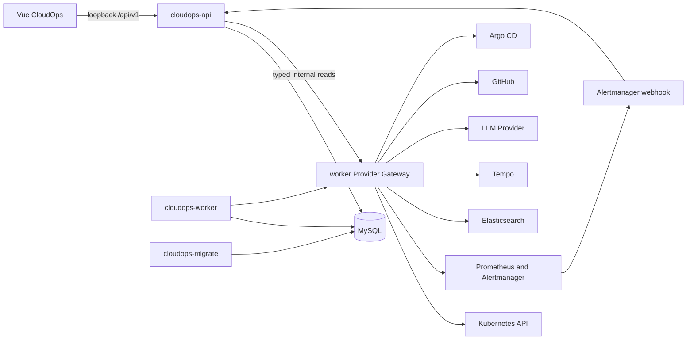

# CloudOps 全栈实施规范

> 状态：`ACCEPTED_FOR_IMPLEMENTATION`
>
> 产品契约：V1
>
> 文档日期：2026-07-26（Asia/Shanghai）
>
> 产品实现状态：`NOT RUN`
>
> 适用范围：前端、后端、API、MySQL 数据、Provider 适配、Agent、本地 kind/Helm 生命周期与真实联调

## 0. 文档地位

本文是 CloudOps 统一平台的实施规范，取代旧的两页 Incident 前端计划，并取代以多个产品代际描述目标架构的旧重构设计。`CONTEXT.md` 定义领域语言，`docs/adr/0018` 至 `docs/adr/0045` 定义已接受决策；发生冲突时，编号更高且明确 supersede/refine 的 ADR 优先。

配套执行入口是 [`CloudOps-Implementation-Taskbook.md`](CloudOps-Implementation-Taskbook.md)。任务书只负责任务依赖、状态和 Codex 提示词，不改变本文的规范权威。

本文允许用 `Phase` 表达实施依赖和验收边界。Phase 只是文档组织方式，不得进入 CloudOps 自有源码、测试、文件名、配置键、Chart profile、资源名、数据库结构或持久数据。

本文是实施授权输入，不是完成证明。任何尚未实际运行的能力均为 `NOT RUN`，不能因出现在本文中而宣称已经实现。

## 1. 最终结果

完成后，Owner 应能从仓库根目录执行 `make local-up`，打开一个无需登录的 loopback CloudOps V1 平台，并在同一原生界面完成以下闭环：

`Observe -> Detect -> Investigate -> Decide -> Act -> Verify`

平台必须满足以下结果：

1. Overview、Infrastructure、Monitoring、Alerts、Logs、Traces、Agent、Incidents、DevOps 和 Settings 都是可直接访问的原生 Workspace。
2. Kubernetes、Metrics、Alerts、Logs 和 Traces 来自真实 Provider；CloudOps 不用隐藏 fixture 填充 Live Mode。
3. Agent 可从 Alert、Incident 或任意观测上下文发起调查与咨询，所有结论引用可追溯 Evidence。
4. Owner 可在 Settings 中修改 LLM、集群、Provider、查询授权和保留策略，而不是反复编辑环境变量。
5. 高影响操作必须先形成不可变 Operation Plan，再由 Owner 对精确内容授权。
6. GitHub、Grafana、Kibana、Tempo、Argo CD 等只作为精确 Context Link 或可选执行分支；核心流程不依赖手动打开 Provider 首页。
7. 桌面、平板和手机保留完整能力，所有普通路由只有一个主纵向滚动容器。
8. 最终第一方实现只有 V1 契约，不存在平行产品代际、阶段化运行时或兼容 UI。

## 2. 不可妥协的边界

### 2.1 产品优先级

- 云原生状态与 Agent 是核心，DevOps/GitOps 是补充。
- Operator 完成任务优先于纯展示效果；展示品质仍是一级验收目标。
- Incident 是可选协调生命周期，不是使用 Monitoring、Logs、Traces 或 Agent 的前置条件。
- Delivery 成功不等于恢复成功；只有回到实时 Evidence 完成 Verify 才闭环。

### 2.2 数据真实性

- Live Mode 只显示真实 Provider 与 CloudOps 领域记录。
- Empty、Stale、Partial、Unavailable、Forbidden 和 Error 都是正式状态，不得被 mock 数据掩盖。
- CloudOps 只保留有界、脱敏、可归因的 Evidence，不复制完整 Metrics、Logs 或 Traces 数据库。
- Demonstration Scenario 必须真实经过 Kubernetes、Prometheus、Alertmanager、Elasticsearch、OpenTelemetry/Tempo、CloudOps API 与 Agent。

### 2.3 Owner 与安全

- 产品仅支持本机单 Owner、loopback、local container/kind 使用。
- 删除 OAuth、oauth2-proxy、账号、登录页、角色映射、RBAC UI 和 CSRF token 流程。
- Provider 凭据只在后端以私有文件保存，永不返回浏览器、日志或 Git。
- 本地 Owner 身份不取消 Origin、幂等、expected revision、hash 绑定、审计和高影响操作确认。
- 任何未来 LAN、远程、多用户或公开部署都需要新的 ADR，不在本次实现中预留半成品模式。

### 2.4 语言与图标

- UI 中文优先；Kubernetes、Prometheus、TraceQL、资源 Kind、status/reason、日志原文、查询语句、SHA 与配置键保持原文。
- 所有产品图标统一使用 Lucide；移除 Element Plus Icons 和手绘替代图标。
- 全程禁止 emoji。
- 首轮不建设语言切换器，也不在页面中放置解释产品功能的营销文案。

## 3. 已核实的当前基线

| 范围 | 当前事实 | 目标差距 |
|---|---|---|
| Go 运行时 | 根模块已有 `cloudops-api`、`cloudops-worker`、`cloudops-migrate` 等入口 | 内部仍有代际包名、兼容认证、旧服务与阶段代码 |
| API | 公开路径仍是 `/api/v3`，主要只有 Incident Query/Command/SSE | 收敛为 `/api/v1` 并覆盖全部 Workspace |
| 前端路由 | 只有 `/incidents`、`/incidents/:id` 和 404 | 缺少另外 8 个 Workspace 与全局通知、Agent 面板 |
| 前端语言 | 大量英文文案、Incident-only 品牌 | 全面中文优先并呈现统一 CloudOps 产品 |
| 图标 | 使用 `@element-plus/icons-vue` | 全量迁移到 Lucide |
| 滚动 | Shell 固定 `100dvh`、外层 `overflow:hidden`、内层 `.app-main` 滚动，并延迟写 `scrollTop` | 文档滚动、URL 状态与原生 history restoration |
| 身份 | OAuth/session、viewer/operator 与 CSRF 仍存在 | Local Owner Mode，无登录和角色 UI |
| Provider 查询 | 主要服务 Agent/Verification 的固定模板 | 缺少用户可执行的 Monitoring、Logs、Traces 与 topology API |
| Agent | 主要是 Incident-scoped Investigation | 缺少全局 Consultation、Context Snapshot、Knowledge Item 管理 |
| 配置 | 大量环境变量，Provider client 启动时构建 | Bootstrap/Operational Configuration 分层和在线 revision apply |
| 数据 | 扩展迁移链中存在代际状态列、schema generation 和阶段命名 | 备份后迁移到单一语义 V1 schema |
| 本地运行 | Compose、kind、Helm、demo 与脚本入口并存 | 顶层 `make local-*` 成为唯一公开入口 |
| 旧资产 | `server-monitor/` 仍包含旧 Chart、Compose、raw manifest、脚本与空旧服务 | 提取仍需资产后删除平行实现 |

当前 UI 的直接规则缺口包括：

- `frontend/src/components/layout/AppLayout.vue:182` 与 `:192` 固定两层 `100dvh`，`:185` 与 `:195` 隐藏外层溢出，`:206` 再创建内部滚动。
- `frontend/src/router/index.ts:21` 读取内层 `scrollTop`，`:55` 延迟 350 ms，`:58` 再写回，造成路由切换竞态。
- `frontend/src/router/routes.ts:4` 默认进入 Incident，`:5` 仅注册一个业务 Workspace。
- `frontend/src/components/layout/AppSidebar.vue:2` 使用 Element Plus 图标，`:35` 暴露错误的代际文案。

这些事实是迁移输入，不是要求保留的行为。

## 4. 单一 V1 与命名规则

### 4.1 V1 的出现位置

`V1` 只标识明确的第一方契约边界：

- `/api/v1`
- OpenAPI 的公开契约身份
- 必须区分外部 DTO 与内部领域模型时的边界 adapter

产品名始终显示为 CloudOps。内部 package、type、function、table、column、index、task、event、environment variable、Helm value、Kubernetes resource 和 UI component 使用语义名称，不统一添加 `V1` 前缀。

### 4.2 最终禁止项

最终第一方实现不得包含：

- 产品代际 V2、V3 或 runtime generation
- `phase3`、`phase7a`、`PHASE_*` 等阶段标识
- 阶段化 Helm profile、cluster、release、image、Make target 或 feature flag
- 代际状态列、代际 schema discriminator 或兼容路由
- 平行 frontend、API、Worker、Chart、Compose 或 Demo

外部强制契约不做错误替换，包括 Kubernetes/Helm `apiVersion`、Prometheus Provider 路径、Go module major suffix、依赖与镜像版本，以及 Provider 原始 payload 字段。外部术语进入领域和 UI 时由 adapter 映射为 CloudOps 的语义状态。

### 4.3 当前名称收敛示例

| 当前表面 | 最终表面 |
|---|---|
| 代际 API router/package | `internal/api`、`registerRoutes`、`/api/v1` |
| 代际 worker/config 前缀 | `ProviderGatewayConfig`、`PROVIDER_GATEWAY_ENABLED` 等语义名 |
| 阶段化 Chart values | 一个 `values.yaml`，另有语义明确的 `values-local.yaml` 与 `values-scenario.yaml` |
| 阶段化 kind/script | `scripts/local-lifecycle.sh`、固定 `cloudops-local` cluster/release identity |
| `v3_status` 与 generation discriminator | 聚合自身 `status`；真实 schema 演进使用 revision/hash |
| 多代 eval 目录 | `eval/agent-quality/current` 与以内容哈希标识的历史快照 |
| 旧产品分支名 | 语义化工作分支，例如 `codex/cloudops-platform` |

### 4.4 自动检查

新增一个第一方命名检查，扫描 `cmd/`、`internal/`、`frontend/src/`、`charts/cloudops/`、`scripts/`、`migrations/`、Makefile 与第一方 fixtures。检查对外部协议、generated/vendor 与依赖锁文件使用窄 allowlist；不得通过全目录排除掩盖第一方残留。

## 5. 统一 Operational Loop

### 5.1 上下文连续性

每次跨 Workspace 导航携带同一 `Operational Context`：

| 字段 | 含义 |
|---|---|
| `cluster_id` | 当前活动集群 |
| `environment` | local、scenario 或配置的环境身份 |
| `namespaces` | 有界 Namespace 集合 |
| `resource_refs` | Kubernetes/Service/Workload/Pod 等稳定身份 |
| `time_range` | 绝对 UTC 起止时间；UI 可使用相对选择器 |
| `query_definition_refs` | 实际执行的查询 revision |
| `evidence_refs` | 已保留 Evidence 身份 |
| `configuration_revision_id` | 产生结果时的 Operational Configuration |
| `scenario_id` | 可选 Demonstration Scenario 身份 |

Workspace 的 cluster、namespace、resource、time range、tab、query、cursor、selection 等可分享状态进入 URL。临时输入、未提交密钥和大体积结果不进入 URL。

### 5.2 Evidence Plane

Kubernetes、Metrics、Alerts、Logs 与 Traces 使用统一资源和时间身份。Provider 返回的数据保持来源、查询、采集时间、范围、freshness 和截断状态。只有被 Agent、Alert、Incident、Operation 或 Verification 引用的有界片段才持久化为 Evidence。

### 5.3 Context Link

所有 API view model 可返回经过后端构造的 Context Link：

| 字段 | 要求 |
|---|---|
| `kind` | internal、provider、source、operation |
| `label` | 中文动作名称，保留 Provider 品牌 |
| `href` | allowlist 验证后的精确地址 |
| `target` | 当前窗口或明确外部窗口 |
| `provider` | 可选 Provider identity |
| `resource_ref` | 精确资源、PR、commit、application 或 trace identity |
| `time_range` | Provider 支持时必须包含 |
| `availability` | available、unavailable、misconfigured |

浏览器不拼接任意 Provider URL，也不渲染来自不可信 payload 的裸链接。

## 6. 目标运行时架构



### 6.1 `cloudops-api`

- 只公开 loopback V1 HTTP、SSE、静态前端与 health endpoints。
- 校验所有 Query/Command、Origin、幂等键、expected revision 和 plan hash。
- 读取 MySQL projection，创建 durable command/task，并通过 typed internal gateway 获取交互式 Provider read。
- 不持有浏览器身份、OAuth token、任意 shell 或 Kubernetes write 能力。

### 6.2 `cloudops-worker`

- 运行 MySQL `async_tasks`，负责 Agent、Alert escalation、Operation execution、Verification、通知生成与 projection refresh。
- 拥有 Provider credentials 和 bounded adapter。
- 提供仅集群内部可达的 typed Provider Gateway；不暴露任意 URL、任意 DSL 或通用 proxy。
- 每个任务在边界处绑定 Configuration Revision、Operational Scope、预算与取消状态。

### 6.3 `cloudops-migrate`

- 是唯一 schema mutation 入口。
- 使用 MySQL advisory lock、forward-only migration、备份/恢复检查和 startup schema identity。
- API/Worker 启动时只校验 schema，不执行 AutoMigrate。

### 6.4 MySQL 与 Provider

- MySQL 是 CloudOps 领域、任务、配置、审计和 retained Evidence 的 durable truth。
- Prometheus、Elasticsearch、Tempo、Kubernetes、GitHub 和 Argo CD 保持各自事实或外部效果的 authority。
- Provider Gateway 的瞬时结果不自动长期落库；结果被引用时才生成有界 Evidence。

## 7. V1 API 约定

### 7.1 通用约定

- Base path：`/api/v1`
- JSON：`application/json`
- 错误：`application/problem+json`，包含 `type`、`title`、`status`、`detail`、`request_id`、`trace_id` 和可执行下一步
- 时间：RFC 3339 UTC；前端用 `Intl.DateTimeFormat` 显示本地时间
- 分页：opaque cursor，不使用不稳定 offset
- Query：请求声明 Operational Scope、绝对 time range、limit 和 query revision
- Command：`Idempotency-Key` + expected revision/hash；冲突返回 409，验证失败返回 422，异步接受返回 202
- Streaming：SSE 支持 `Last-Event-ID`、bounded reconnect 和显式终止状态
- 所有响应标记 source、collected_at、freshness、partial/truncated 和 Context Links
- 浏览器无需 session、Bearer token 或 CSRF token；mutation 仍校验 loopback Origin

### 7.2 Endpoint 清单

| 领域 | Endpoint | 用途 |
|---|---|---|
| Bootstrap | `GET /bootstrap` | 产品能力、活动配置、Provider health、active scope、Scenario 状态 |
| Scope | `GET /scopes` | 可选集群、环境和 Namespace |
| Overview | `GET /overview` | Operational Loop 摘要与 Atlas overlay summary |
| Infrastructure | `GET /topology` | typed nodes/edges、health、provenance、partial state |
| Infrastructure | `GET /topology/events` | topology/overlay refresh SSE |
| Infrastructure | `GET /resources` | 结构化资源列表与筛选 |
| Infrastructure | `GET /resources/{id}` | 资源详情、owner、selector、Endpoint、状态和 links |
| Infrastructure | `GET /resources/{id}/events` | 有界 Kubernetes Events |
| Monitoring | `GET /monitoring/catalog` | 指标与推荐中文查询定义 |
| Monitoring | `POST /monitoring/queries` | 执行受限 guided/PromQL query |
| Monitoring | `GET /monitoring/queries/{id}` | 查询结果、状态与 bounds |
| Monitoring | `POST /monitoring/queries/{id}/cancel` | 取消尚未完成的查询 |
| Logs | `POST /logs/queries` | 执行受限 Elasticsearch query |
| Logs | `GET /logs/queries/{id}` | histogram、bounded entries、fields 与 links |
| Logs | `GET /logs/queries/{id}/events` | 可选有界 tail SSE |
| Traces | `POST /traces/searches` | guided/TraceQL search |
| Traces | `GET /traces/searches/{id}` | Trace summaries |
| Traces | `GET /traces/{trace_id}` | waterfall、spans、attributes、logs/resources links |
| Query | `GET/POST /query-definitions` | 版本化 guided/expert 查询定义 |
| Query | `GET/POST/DELETE /query-authorizations` | Agent 一次或持久受限查询授权 |
| Alerts | `GET /alerts` | firing/resolved、severity、ack/silence/investigation/incident facets |
| Alerts | `GET /alerts/{id}` | Alert 详情、Signals、history、Evidence 与 links |
| Alerts | `POST /alerts/{id}/acknowledgements` | 幂等确认 |
| Alerts | `POST /alerts/{id}/silences` | 创建 provider-backed bounded silence |
| Alerts | `POST /silences/{id}/expire` | 提前结束 silence |
| Alerts | `POST /alerts/{id}/investigations` | 发起 Agent Investigation |
| Alerts | `POST /alerts/{id}/incident-links` | 创建 Incident 或关联已有 Incident |
| Agent | `GET /agent/investigations` | 全局 Investigation 列表 |
| Agent | `GET /agent/investigations/{id}` | steps、tools、Evidence、outcome、configuration identity |
| Agent | `POST /agent/investigations/{id}/cancel` | 有界取消 |
| Agent | `GET/POST /agent/consultations` | 列表或创建 Consultation |
| Agent | `GET /agent/consultations/{id}` | durable history 与 active snapshot |
| Agent | `POST /agent/consultations/{id}/snapshots` | 显式附加不可变 Context Snapshot |
| Agent | `POST /agent/consultations/{id}/messages` | 发送 Owner message |
| Agent | `GET /agent/consultations/{id}/events` | tool progress 与 answer SSE |
| Agent | `POST /agent/consultations/{id}/cancel` | 取消当前 turn，不删除 history |
| Knowledge | `GET/POST /knowledge-items` | 浏览或确认保存 Knowledge Item |
| Knowledge | `GET/PATCH/DELETE /knowledge-items/{id}` | 查看、修订、禁用或删除 |
| Incidents | `GET/POST /incidents` | 查询或显式创建 Incident |
| Incidents | `GET /incidents/{id}` | Incident projection |
| Incidents | `GET /incidents/{id}/timeline` | lifecycle cursor |
| Incidents | `GET /incidents/{id}/evidence` | retained Evidence |
| Incidents | `GET /incidents/{id}/investigations` | Investigation history |
| Incidents | `POST /incidents/{id}/investigations` | 发起调查 |
| Incidents | `POST /incidents/{id}/close` | 满足状态约束后关闭 |
| Incidents | `GET /incidents/{id}/events` | Incident refresh SSE |
| DevOps | `GET /changes` | ChangeCandidate 与 deployment identity |
| DevOps | `GET /changes/{id}` | exact revisions、assessments、related evidence |
| Operations | `GET/POST /operation-plans` | 查询或创建不可变计划 |
| Operations | `POST /operation-plans/{id}/authorizations` | 对 exact hash 授权或拒绝 |
| Operations | `GET /operations/{id}` | execution、audit、result 与 verification intent |
| Delivery | `GET /deliveries/{id}` | PR/CI/merge/Argo/rollout 精确状态 |
| Verification | `GET /verifications/{id}` | samples、checks、common window、result |
| Settings | `GET /settings` | Bootstrap diagnostics 与 Operational Configuration summary |
| Settings | `POST /settings/validate` | schema、scope、连接和 client construction 验证 |
| Settings | `POST /configuration-revisions` | 原子发布新 revision |
| Settings | `GET /configuration-revisions` | 历史与 active identity，不回显 secret |
| Settings | `POST /secrets` | write-only secret version |
| Settings | `POST /providers/{provider}/tests` | 有界连接测试 |
| Settings | `GET /storage-status` | retention、容量、backup recency |
| Notifications | `GET /notifications` | 持久 Inbox 与 unread cursor |
| Notifications | `POST /notifications/{id}/read` | 标记已读 |
| Notifications | `POST /notifications/read-all` | 对当前 cursor 前记录标记已读 |
| Notifications | `GET /notification-events` | 新通知 SSE 与 browser mirror trigger |

Endpoint 实现时必须同步生成 OpenAPI、Go contract tests 与前端 typed client。组件不能直接拼 URL 或维护第二套 DTO。

## 8. Workspace 实施规格

### 8.1 Overview `/overview`

**主要任务**：用一个活动集群的真实 Operations Atlas 展示当前系统状态，并让 Owner 进入 Operational Loop 的下一步。

**界面**：

- 首屏是全宽 2.5D Atlas，不放在装饰 Card 中。
- 顶部保留 cluster/environment/Namespace/time selector、Provider health、Scenario 标记和 Notification Inbox。
- Atlas 使用 Namespace、Service、Workload 作为默认层，选择或缩放后展开 Pod、Node、Ingress/Gateway。
- Metrics、Alerts、Logs/Traces availability 和 Agent activity 使用可辨识 overlay，不伪造结构 edge。
- 提供与 Canvas 同数据的结构化资源视图，支持键盘、搜索和无 WebGL fallback。
- Loop rail 仅呈现有真实事件的 Observe/Detect/Investigate/Decide/Act/Verify 状态，不做静态营销流程图。

**操作与链接**：选择资源可进入 Infrastructure；选择 Alert 进入 Alerts；选择 Agent activity 进入具体 Investigation；选择 telemetry overlay 带相同时间范围进入 Monitoring、Logs 或 Traces。

### 8.2 Infrastructure `/infrastructure`

**主要任务**：浏览真实 Kubernetes 结构、状态、关系与 Events，并从资源上下文继续观测或调查。

**界面**：资源树/表与拓扑切换、typed filters、资源 detail inspector、owner references、selectors、EndpointSlices、scheduling、conditions、recent Events、staleness。

**约束**：不做通用任意 YAML 浏览器；敏感字段必须过滤。大集群使用 pagination、progressive expansion 与 node limit。

**操作与链接**：打开相关 Metrics、Logs、Traces、Alerts；创建冻结上下文的 Agent Consultation；高影响 Kubernetes action 只能创建 Operation Plan。

### 8.3 Monitoring `/monitoring`

**主要任务**：直接查看和比较 Metrics，支持中文引导与 expert PromQL。

**界面**：metric catalog、guided query builder、time-series plot、legend/table、query history、bounds、step、source freshness、partial state。模式切换使用 segmented control，颜色只表达 series 与状态，不使用单一蓝色系。

**查询**：默认生成可检查的 Query Definition；expert 输入仍受 provider、time range、series count、timeout、response bytes 和 concurrency 限制。查询文本、scope 和 revision 可复制、保存、授权 Agent 或生成 Context Link。

### 8.4 Alerts `/alerts`

**主要任务**：独立管理 Alert，而不是把 Alert 列表伪装成 Incident。

**界面**：高密度 triage list、firing/resolved facet、severity、duration、recurrence、acknowledged、silenced、investigating、Incident link、Alert detail timeline 和原始 Signal provenance。

**操作**：acknowledge、bounded silence、start Investigation、create Incident、attach Incident。默认关闭自动 escalation；Settings 中的 Escalation Policy 显示 exact Configuration Revision。

**约束**：没有 assignment；resolved Alert 不自动关闭 Incident；silence 不等于 acknowledgement 或 resolution。

### 8.5 Logs `/logs`

**主要任务**：在相同资源与时间上下文中检索、聚合和阅读真实 Logs。

**界面**：中文 guided filters、expert restricted Elasticsearch query、time histogram、virtualized log rows、field inspector、wrap/nowrap、level/resource/trace filters、truncation 与 stale state。

**链接**：`trace_id` 进入 Trace；Kubernetes identity 进入 Infrastructure；pattern/time window 进入 Monitoring 或 Agent；Provider expert link 精确打开 Kibana 查询和时间范围。

### 8.6 Traces `/traces`

**主要任务**：搜索 Trace、查看 waterfall/span 关系并关联 Logs、Metrics 和 Kubernetes resource。

**界面**：guided/TraceQL search、Trace list、waterfall、critical path、span attributes/events/status、service map context、source freshness。长 attributes 使用 inspector，不挤压主布局。

**链接**：span 进入关联 Logs；service/workload 进入 Infrastructure；异常 Trace 可创建 Context Snapshot 并启动 Agent Consultation。

### 8.7 Agent `/agent`

**主要任务**：管理 Investigation、Consultation、Knowledge Item 与 Runbook Guidance，并清楚展示 Agent 正在读取什么、为何得出结论、能否执行操作。

**界面**：

- 左侧为 Consultation/Investigation history，中间为当前工作区，右侧为 Context Snapshot/Evidence/authorization inspector；移动端按 tabs 分层。
- tool progress 展示 tool、target、scope、status、duration 和 Evidence output，不展示 chain-of-thought。
- 每个 answer 引用 Evidence ID、source time、query revision、Knowledge Item/Runbook revision 和 uncertainty。
- 全局 Agent 面板可在其他 Workspace 打开，但初次绑定的 Context Snapshot 不随导航静默变化；Owner 必须显式“附加当前上下文”。

**记忆**：旧聊天只在原 Consultation 中持久化。Agent 可建议保存 Knowledge Item，Owner 一键确认后才进入跨会话检索；过期或 scope 不匹配的知识不可冒充当前事实。

### 8.8 Incidents `/incidents`

**主要任务**：协调需要持续跟踪的响应 case，同时保持 Alert、Evidence、Agent、Operation 与 Verification 的独立身份。

**界面**：Incident list + detail。Detail 保留 What happened、Investigation、Decision/Delivery、Recovery 四个业务区，但不再承担全平台导航。List 支持 severity、status、attention、resource、time 与 related Alert 筛选。

**操作**：start Investigation、link/unlink eligible Alert、review Operation Plan、close。Resolution 只来自满足约束的 Verification；Delivery 状态不能直接映射为 Resolved。

### 8.9 DevOps `/devops`

**主要任务**：提供 change intelligence、exact deployment identity、受控 delivery 和 GitOps evidence；它是可选执行分支。

**界面**：ChangeCandidate list、source/image/GitOps revision diff、DeploymentBaseline、Operation Plan、authorization、PR/CI/Argo/rollout status、Verification result。

**约束**：GitHub/Argo 不可用时 CloudOps 核心仍工作。所有外链指向 exact repository/commit/PR/application/revision。无授权不执行 write；无验证不宣称 recovery。

### 8.10 Settings `/settings`

**主要任务**：让 Owner 在 UI 内管理运行中的 CloudOps Operational Configuration。

**分区**：LLM、Clusters、Prometheus/Alertmanager、Elasticsearch、Tempo、GitHub、Argo CD、Context Link bases、Query Definitions/Authorizations、Escalation Policies、Knowledge/Runbooks、retention/storage、browser notifications、Bootstrap diagnostics。

**交互**：edit draft -> validate -> provider test -> review diff -> apply revision。Secret 字段永远为空或显示 configured/missing/invalid 与 fingerprint；修改时创建新 secret version。

**边界**：不能从网页执行 `local-up/down/reset` 或重启 runtime。页面只显示 lifecycle/backup/storage 状态和对应 Make command 的结果事实，不提供邮件、钉钉、短信、Slack 配置。

## 9. 全局通知与 Agent 入口

### 9.1 Notification Inbox

- Header 提供 Lucide `Bell` icon、未读计数和 drawer/sheet。
- 每条 Owner Notification 包含 source、severity、created_at、reason、read state 和 exact Context Link。
- P1/P2 Alert、Agent completion/failure、authorization pending、Operation completion/failure 可在一次浏览器授权后镜像为 system notification。
- 低优先级只进入 Inbox；同源同状态聚合、去重和 cooldown。
- 浏览器关闭后不声称送达；首轮不实现外部消息渠道。

### 9.2 全局 Agent 面板

- Desktop 是可固定的侧面工作区，mobile 是全屏 sheet；两者与 `/agent` 使用同一 Consultation state。
- 从任意资源发起时，先展示将被冻结的 scope、resource、time range、queries 与 Evidence。
- 导航后显示“当前页面上下文与会话快照不同”，但不自动替换。
- Action proposal 只生成 Action Card 或 Operation Plan，不在聊天输入框直接执行。

## 10. 后端模块与所有权

保留现有根模块和经过验证的 bounded domain logic，不创建新的通用框架层。目标 package 以领域和职责命名：

```text
cmd/
  cloudops-api/
  cloudops-worker/
  cloudops-migrate/
internal/
  api/                    # V1 HTTP contract, Problem Details, SSE
  alert/                  # Alert lifecycle and escalation
  incident/               # Incident aggregate and coordination
  agent/                  # Investigation, Consultation, Knowledge retrieval
  evidence/               # Evidence identity, trust, retention
  infrastructure/         # topology projection and Kubernetes view model
  observability/          # query definitions, bounds and correlations
  operation/              # plans, authorizations and execution lifecycle
  notification/           # durable Owner Notification
  settings/               # configuration revisions and secret references
  asyncjob/               # MySQL task runtime
  taskhandler/             # semantic task handlers
  infra/                   # bounded provider and MySQL adapters
  bootstrap/               # process assembly, health, shutdown
migrations/
frontend/
charts/cloudops/
scripts/
```

已有 `internal/remediation`、`internal/verification`、change intelligence、GitHub/Argo/Kubernetes/Prometheus adapter 和 MySQL repository 优先适配，不为了目录整齐而重写已验证算法。代际 package、legacy service、Redis/Kafka、direct Kubernetes repair 和平行 server runtime 在等价能力迁移后删除。

## 11. 数据模型与保留

### 11.1 MySQL 领域所有权

| 领域 | Durable records |
|---|---|
| Configuration | `configuration_revisions`、provider/cluster settings、secret references、validation results |
| Scope/Topology | bounded topology snapshots、resource identities、provider health |
| Alert | Signals、Alerts、acknowledgements、silences、Alert events、Incident links |
| Incident | Incidents、timeline、Alert relations、resolution reports |
| Agent | Investigations、steps、tool calls、Consultations、messages、Context Snapshots |
| Knowledge | Knowledge Items/revisions、Runbook retrieval references |
| Evidence | Evidence Items、source/query/scope identity、supersession/retention links |
| Query | Query Definitions、Authorizations、execution audit；不长期复制完整结果 |
| Operation | Operation Plans、Action Authorizations、operations、delivery、verification |
| Notification | Owner Notifications、dedupe identity、read state |
| Runtime | async tasks/attempts、idempotency records、audit entries |

表名可按现有模型和 migration 约束调整，但领域所有权、引用与删除规则不能合并成一个无类型 JSON store。

### 11.2 单一 V1 schema 收敛

当前迁移链包含产品代际与阶段命名，不能成为最终 clean-install history。收敛按以下顺序执行：

1. `make local-backup` 生成校验和、schema identity、row counts、secret revision manifest 与数据库 dump。
2. 只读检查所有必需表、外键、事件顺序、Evidence 引用、Operation hash 和 active work。
3. 在隔离 MySQL 中创建一份语义化 clean baseline，不复用 generation discriminator。
4. 使用一次性、可审查的转换工具导入现有领域数据；旧 ID、public ID、timestamp、source identity、hash 和 provenance 保持不变。
5. 将历史 generation-specific status 映射到聚合自身 status；无法无损映射的记录标记为 imported history，不伪造成实时 Evidence 或当前授权。
6. 对源/目标 counts、FK、unique identity、timeline ordering、hash 与 retained Evidence 做双向审计。
7. 原子切换到新 schema，启动 API/Worker，使用真实 UI 读取现有 Incident/Agent/Evidence。
8. 验证成功后删除一次性转换工具、旧 migrations、compatibility packages 和旧 schema references；保留私有 backup 以便恢复。

迁移失败不得调用 `local-reset` 掩盖问题。任何 destructive retry 前必须确认现有 backup 可恢复。

### 11.3 Retention

- CloudOps domain/configuration/Alert/Incident/Agent/Operation/retained Evidence 默认无基于年龄的自动删除。
- Prometheus 与 Elasticsearch 默认保留 7 天，Tempo 默认 72 小时，并设置容量上限。
- Provider raw data 过期后，UI 仍可展示 retained Evidence，但必须标明原始窗口已不可查询。
- Knowledge/Consultation 删除不得破坏其他 retained record 对历史 revision 的解释能力。

## 12. Operational Configuration 与 secrets

### 12.1 Bootstrap Configuration

仅包含 listen boundary、MySQL DSN/reference、backend data directory、internal worker endpoint 和启动必需路径。Settings 只读展示 effective value 与诊断；修改需通过本地文件和显式 `make local-restart`。

### 12.2 Operational Configuration

包括：

- LLM provider、model、temperature/limits、timeout、并发和预算
- Kubernetes contexts、cluster identity、Namespace allowlist
- Prometheus、Alertmanager、Elasticsearch、Tempo endpoints 与 bounds
- GitHub/Argo CD identities、allowlists 与 exact Context Link bases
- query limits、saved definitions、Agent authorization policy
- escalation、retention、storage ceiling、notification preference

每次 apply 创建不可变 Configuration Revision。Provider client 在 query/task 边界按 revision 构建或缓存；active Agent work 继续使用启动时 revision。

### 12.3 Secret storage

- 后端 data directory 下按 secret revision 保存，文件与目录权限为 `0600/0700`。
- API write-only；response 只返回 state、fingerprint、created_at、referenced_by。
- validation log 不包含 secret、完整 header、DSN password 或 provider response credential。
- cleanup 只能删除无任何 retained revision 引用的 secret version。

## 13. Agent 实施合同

### 13.1 Investigation

- Trigger：Alert 或 Incident。
- Input：不可变 Context Snapshot、Configuration Revision、budget、allowed tools 与 Query Authorization。
- Persist：Run、Step、tool call、StateDelta、Evidence refs、uncertainty、outcome、error classification。
- Outcome：diagnosed、insufficient、cancelled、failed；不能用 generic completed 掩盖诊断不足。

### 13.2 Consultation

- Owner 创建、持久化、可跨 Workspace 打开。
- 每个 turn 使用当前 Consultation 的显式 snapshots，不读取隐藏 page state。
- tool 调用通过相同 bounded Provider adapters，结果引用 Evidence。
- streaming 可取消、可恢复读取；取消不删除已持久化历史。

### 13.3 Knowledge 与 Runbook

- Knowledge Item 需要 Owner 精确确认，记录来源、scope、created/review/expiry 和 revision。
- Agent 使用时显示 citation 与 age；过期、禁用或 scope mismatch 不进入自动检索。
- Git-managed Runbook Guidance 保持独立 provenance。
- Knowledge 与 Runbook 只提供 guidance，不能建立根因、完成 Evidence sufficiency 或授权写操作。

### 13.4 Authority

| 等级 | 能力 | Owner 行为 |
|---|---|---|
| Read | bounded provider read、已授权 query、Evidence correlation | 无逐次确认或使用已有 Query Authorization |
| Reversible | local、低影响、易撤销 action card | 一次精确确认 |
| High impact | Kubernetes/GitHub/Argo 等外部效果 | 审查不可变 Operation Plan 后精确授权 |

任何 material target、parameter、diff、precondition、risk、expiry 或 verification intent 变化都会产生新 plan identity。

## 14. 前端架构与视觉系统

### 14.1 技术栈

- 保留 Vue 3、Vite、Vue Router、Pinia、TypeScript、Element Plus controls 与 Sass/CSS tokens。
- 删除 `@element-plus/icons-vue`，使用 `lucide-vue-next`。
- 增加 Three.js，只在 Overview/Atlas route lazy-load。
- 图表优先使用成熟、可访问且支持大数据的现有库；选型在 Monitoring Phase 开始时通过 bundle、交互和维护性核对，不手写 time-series engine。
- Provider/query parsing 使用正式 parser 或 Provider API，不在组件内以字符串拼接实现。

### 14.2 路由与状态

- `/` 重定向 `/overview`。
- 十个 Workspace 全部 route lazy-load。
- URL 保存 filters、tabs、cursor anchor、time range、selected resource 与 query identity。
- Pinia 只保存跨路由且不适合 URL 的 transient UI state、active Consultation 与 notification state。
- API client 按领域拆分，共享 Problem Details、cancel、SSE、request identity 与 Context Link 处理。

### 14.3 Shell 与滚动

- `body`/document 是普通 Workspace 的唯一主纵向 scroll owner。
- Sidebar 与 header 使用 `position: sticky`，不以两层 `100dvh + overflow:hidden` 锁住页面。
- Atlas 使用稳定剩余视口并禁止第二个 page scrollbar；其 inspector 可独立滚动。
- Log viewer、table、diff、drawer、sheet、modal 是唯一允许的 bounded scroll region，并必须有可访问名称和 keyboard scroll。
- 删除 `mainScrollPositions`、延迟 `scrollTop` 写入和 DOM polling；使用 Vue Router 原生 document scrollBehavior。
- headings 使用 `scroll-margin-top`，route change 将 focus 放到新 `h1`，Back/Forward 依靠 URL 与 browser history。

### 14.4 Responsive navigation

| Viewport | Navigation |
|---|---|
| Desktop | 分组 sidebar，可显式 collapse |
| Tablet | Lucide icon rail，hover/focus Tooltip 与 accessible name |
| Mobile | bottom nav：Overview、Alerts、Agent、Incidents、More |

More sheet 直接列出 Infrastructure、Monitoring、Logs、Traces、DevOps、Settings。手机保留查询、配置、Agent 与 confirmed mutation，不退化为只读版。

### 14.5 Visual language

- Overview 可采用实验性排版和全幅 Atlas，其他运营 Workspace 使用紧凑、稳定、可扫描的布局。
- 基础使用 black/white/graphite neutral；cyan、green、amber、red、magenta 等分别表达关系、健康、注意、风险和 Agent，不做单一蓝紫主题。
- 不使用 gradient orb、bokeh、glow-heavy sci-fi、营销 hero、满屏同款 Card 或 Card 嵌套。
- Page section 使用无框 band；Card 只用于重复实体、Modal 或确有边界的工具，radius 不超过 8 px。
- 显示字体与密集面板字体分级；不按 viewport 缩放 font-size；letter-spacing 为 0。
- SHA、query、Logs、diff 与数字列使用 mono/tabular numerals。
- Motion 只表达真实关系或状态变化，可中断；`prefers-reduced-motion` 移除持续运动。

### 14.6 Accessible interaction

- Icon-only button 使用 Lucide + `aria-label`，未知图标提供 Tooltip。
- action 使用 button，navigation 使用 RouterLink/a；不得用 clickable div/span。
- form 有可见 label、name、适当 input type/inputmode/autocomplete，错误贴近字段并 focus first error。
- async status 使用 `aria-live=polite`，dialog/drawer 关闭后恢复 trigger focus。
- touch target 至少 44 x 44 px；200% zoom 与 320 px viewport 不遮挡操作。
- 长中文、Namespace、resource name、URL、SHA、query 与 log line 有 wrap/truncate/expand 策略。
- 超过 50 行的 Logs、resource、Alert 和 Timeline 使用 virtualization 或 `content-visibility`。

### 14.7 Performance targets

- Lighthouse Performance：desktop >= 90，mobile >= 85；Accessibility >= 95。
- LCP <= 2.5 s、INP <= 200 ms、CLS <= 0.1。
- 初始 shell JavaScript <= 300 KiB gzip；Three.js/Atlas 不阻塞其他 route 首屏。
- Atlas 标准 200 visible nodes：desktop 目标 60 fps，mobile 不低于 30 fps。
- Atlas 按能力降低 DPR、label density、shadow/postprocessing；不隐藏 Alert 或篡改 topology。
- 页面 hidden 时暂停高频刷新与 rendering；WebGL failure 显示同投影结构化 fallback，不能出现 blank canvas。

## 15. 本地生命周期

顶层 Make 是唯一公开入口，复杂行为放在 `scripts/`：

| Command | 行为 |
|---|---|
| `make local-up` | preflight、获取 pinned tools、创建/复用 kind、build/load image、migrate、Helm apply、wait、stable loopback URL |
| `make local-open` | 打开或打印当前 CloudOps URL |
| `make local-status` | runtime、Provider、storage、revision、Scenario 摘要 |
| `make local-logs` | 按 component 读取 bounded logs |
| `make local-restart` | 保留数据并重启 CloudOps workload |
| `make local-doctor` | 区分 prerequisite、stale state、schema、Provider 与 port 问题 |
| `make local-down` | 停止项目资源但保留 durable data |
| `make local-backup` | 私有、checksummed DB/config/secret backup |
| `make local-restore BACKUP=...` | 验证版本、checksum、target state 后一致恢复 |
| `make local-reset` | backup-first、显式确认后删除 CloudOps persistent state |
| `make scenario-up` | 启动真实 bounded fault Scenario |
| `make scenario-status` | 显示 Scenario resources、fault 与 Evidence Plane readiness |
| `make scenario-down` | 只删除 Scenario runtime，保留 history |

工具缓存、runtime state、backup 与 secret directories 使用确定的 Git-ignored 路径。命令只能操作明确命名和 label 的 `cloudops-local` 资源，不修改无关 Docker/kind/Kubernetes 对象。

## 16. 实施 Phases

每个 Phase 是一个可运行的大功能边界，前端、后端、数据与 Provider 同时交付。Phase 内可运行聚焦 build/test 诊断问题，但只在整个 Phase 完成后进行一次真实 MCP 联调验收。

### Phase 0：单一 V1 收敛与可恢复本地基线

**目标**：清除平行代际/阶段实现，建立可持续演进的唯一 V1 runtime，并保留当前本地数据。

**实施范围**：

- 先实现 `local-backup/restore/doctor`，再进行 schema 与命名迁移。
- `/api/v1`、`internal/api`、semantic config/task/resource names；删除 auth/session/RBAC/CSRF。
- 执行第 11.2 节 clean baseline + one-time data transformation。
- 将 Chart、kind、scripts、Make、cluster/release/image identity 收敛为语义命名。
- 从 `server-monitor/` 提取仍需 Runbook/Scenario/provider fixtures 后删除平行 Compose、raw manifests、Chart 与旧服务。
- 收敛 eval assets 到 content-addressed Agent Quality dataset。
- 更新 active docs、OpenAPI、tests 与自动 naming check。

**MCP 验收**：`make local-up` -> 打开 CloudOps -> 无登录访问现有 Incident -> Network 仅使用 `/api/v1` -> 查看 retained Evidence -> `local-down/up` 后数据仍在。另验证一次旧数据 backup restore。

**退出条件**：第一方 code/data naming check PASS；旧 routes/runtime/schema/profile 不存在；数据审计 PASS；无法运行的外部 Provider 明确 `NOT RUN`。

### Phase 1：平台 Shell、Operational Scope 与 Settings

**目标**：让 Owner 能稳定启动、导航和配置后续 Provider 能力。

**实施范围**：

- 新 responsive shell、十 Workspace navigation、document scrolling、中文基础状态、Lucide。
- `/overview` 基础状态、`/settings`、bootstrap/scope/settings/provider test API。
- Configuration Revision、secret version、Provider health 与 active scope persistence。
- Notification Inbox 的 durable schema、header entry 与 stream 基础；尚无业务事件时显示 truthful empty。
- 全局 Problem Details、Context Link、SSE、URL context utilities。

**MCP 验收**：Settings 修改一个非 secret LLM/provider value -> validate -> apply -> 页面显示新 revision -> Worker boundary 使用新 revision；写入 secret 后 response 不回显；Back/Forward 与长 Settings 页面滚动正常。

**退出条件**：Bootstrap/Operational Configuration 分层正常，失败 apply 不影响 active revision，mobile 可访问全部 Workspace，scroll bug 消失。

### Phase 2：Infrastructure 与 Operations Atlas

**目标**：直接查看一个真实活动集群的结构与状态。

**实施范围**：

- Kubernetes typed reader、topology projection、resource/events API、provider health。
- Overview Three.js Atlas、structured fallback、Infrastructure resource explorer。
- 多 cluster configuration 与单 active cluster selector。
- 真实 structure edges、stable layout、progressive detail、Context Links。

**MCP 验收**：从 Atlas 选择真实 Workload -> Infrastructure detail -> 查看 Pod/Event -> 切换 Namespace -> Back 返回原 selection；停止 Kubernetes Provider 后显示 partial/unavailable 而非 fake topology。通过 screenshot 与 canvas pixel check 验证非空 scene。

**退出条件**：真实 topology 与结构化视图一致；WebGL fallback 可用；desktop/mobile 无遮挡或 blank canvas。

### Phase 3：Monitoring

**目标**：在原生 Workspace 完成 guided 与 expert Metrics 查询。

**实施范围**：

- Prometheus catalog/query adapter、bounds、concurrency、timeout、response-size 与 cancellation。
- Query Definition/Execution persistence and audit；只有 retained reference 进入 Evidence。
- time-series/chart、table、query history、resource/time Context Links。
- Agent Query Authorization 基础。

**MCP 验收**：选择真实 Workload -> guided CPU/error query -> 查看 chart/table -> 切换 expert PromQL -> 保存 Query Definition -> 打开 Grafana exact link；非法/过大 query 显示可修复 422。

**退出条件**：真实 UI-to-Prometheus query PASS；Provider unavailable state PASS；fixture 结果不计联调。

### Phase 4：Logs 与 Traces

**目标**：形成 Metrics、Logs、Traces 之间可追踪的观测链路。

**实施范围**：

- Elasticsearch bounded query、histogram、virtualized rows、field projection、tail bounds。
- Tempo search/Trace detail、waterfall/span model、TraceQL bounds。
- Kubernetes resource attributes、trace/log correlation 与 exact Kibana/Tempo links。
- 保存为 Evidence 和启动 Agent Consultation 的统一 Context Snapshot。

**MCP 验收**：从 Monitoring 时间点进入相关 Logs -> 选择含 `trace_id` 的真实 log -> 打开 Trace waterfall -> 返回 Workload -> 创建冻结上下文。再验证无结果、截断和 Provider unavailable。

**退出条件**：跨 Workspace resource/time identity 保持；Logs/Traces 首轮核心能力均能真实查询。

### Phase 5：Alerts 与显式 Incident escalation

**目标**：让 Signal 更新独立 Alert lifecycle，并提供可控 triage。

**实施范围**：

- Signal-to-Alert normalization、Alert state/events、ack/silence/investigation/Incident link。
- Alertmanager silence adapter、idempotency、audit 与 default auto-escalation off。
- Alerts Workspace、detail、filters、Context Links、P1/P2 Owner Notification。
- Settings Escalation Policy revision 与 bounded matcher。
- 迁移现有 automatic Signal-to-Incident 行为，保留历史 provenance。

**MCP 验收**：真实 Alertmanager firing -> Alert 出现且不自动建 Incident -> acknowledge -> bounded silence -> start Investigation 或显式 create/link Incident -> resolved Signal 更新 Alert 但不关闭 Incident。

**退出条件**：Alert/Incident 不再同义；重复 webhook 不产生重复 Alert/Incident；通知聚合与 deep link 正常。

### Phase 6：Agent Investigation、Consultation 与 Knowledge

**目标**：把 Agent 提升为云原生核心工作区，并保持证据、上下文和权限可解释。

**实施范围**：

- Alert/Incident Investigation API 与全局 Consultation/message/SSE/context snapshot API。
- bounded Kubernetes/Metrics/Logs/Traces tools、tool progress、Evidence citation。
- Agent Workspace、global panel、cancel/reconnect、uncertainty 与 no-CoT presentation。
- Knowledge Item CRUD/revision/scope/review；Runbook Guidance 独立检索。
- action card、Operation Plan proposal 与三层 authority。

**MCP 验收**：从真实 Alert 启动 Investigation -> 查看 tools/Evidence/outcome -> 在 Logs 打开 Consultation -> 导航后上下文不变 -> 显式附加新 snapshot -> Agent 建议保存 Knowledge -> Owner 确认 -> 新 Consultation 引用 exact revision 和 age。

**退出条件**：答案可追溯，隐藏旧聊天不注入，Knowledge/Runbook 不冒充 Evidence，未经授权不执行 mutation。

### Phase 7：Incident 协调与 Verify 回路

**目标**：将现有 Incident 能力接入统一 Alert/Evidence/Agent/Operation 领域，而不是继续承载整个产品。

**实施范围**：

- Incident list/detail V1 projection、Alert relations、timeline、Evidence、Investigation、decision/recovery zones。
- cycle isolation、attention、close、resolution report 与 Verification semantics。
- Context Links 覆盖 Monitoring、Logs、Traces、Agent、Alert 和 optional DevOps。
- 删除 Incident-only brand、旧英文 copy 与已被新 Workspace 取代的 section。

**MCP 验收**：从 Alert 创建 Incident -> 关联第二个 Alert -> Investigation -> no-change 或 action decision -> Verification failed 回到 Investigate -> passing common window 后 ResolutionReport -> close。

**退出条件**：Incident 可协调完整 loop 但不阻塞非 Incident workflow；Delivery 不直接产生 Resolved。

### Phase 8：受控 Operations 与 DevOps

**目标**：在明确需要动作时提供可审查、可授权、可验证的执行分支。

**实施范围**：

- Operation Plan、Action Authorization、execution/audit/expiry/precondition。
- local reversible actions 与高影响 Kubernetes/GitHub/Argo execution boundary。
- ChangeCandidate、DeploymentBaseline、exact source/image/GitOps identity。
- DevOps Workspace、diff/hash、PR/CI/Argo/rollout、Verification links。
- GitHub/Argo 不可用时保持核心 loop 正常。

**MCP 验收**：Agent 生成 exact Plan -> Owner 审查并授权 -> execution -> current Evidence Verify；修改任一 material field 后旧授权失效。GitHub/Argo path 若无凭据报告 `NOT RUN`，不以 mock 代替。

**退出条件**：零授权零外部写；operation 与 verification 全链可审计；DevOps 不成为核心前置依赖。

### Phase 9：真实 Scenario、视觉质量与最终收敛

**目标**：用真实受控故障证明完整主链，并删除所有临时兼容与未使用资产。

**实施范围**：

- `scenario-up/status/down`、真实 workload/traffic/fault、Scenario identity。
- 完整 Observe-to-Verify browser flow；DevOps branch 可选。
- Atlas/route responsive、Canvas、performance、accessibility、long content 与 failure-state diagnostics。
- 删除 temporary adapters、fixture claims、dead docs/links、parallel deployment path 和 inactive UI。
- 更新 README、architecture、API、operations、security、reliability 与 evidence report。

**MCP 验收**：启动 Scenario -> Atlas degradation -> Alert -> related Logs/Trace -> Agent Evidence -> Owner-authorized recovery -> Metrics/Alert/Kubernetes/Trace Verify -> retained history -> scenario-down 后 Live Mode 无假数据。

**退出条件**：核心真实联调 PASS；所有未运行外部项显式 `NOT RUN`；命名、data retention、scroll、mobile、Context Link 和 notification final checks 完成。

## 17. 验证策略

### 17.1 何时验证

- 不在每个小编辑后运行全部测试。
- 实现期间只运行使当前 capability 可编译、可启动或定位故障所需的 focused checks。
- 每个 Phase 完成后运行一次代表性的真实前后端 MCP 联调和一个最相关的 failure/unavailable path。
- 跨 Phase 的完整 Scenario 只在 Phase 9 运行。

### 17.2 MCP 联调证据

每次验收记录：

| 项目 | 证据 |
|---|---|
| Build/runtime | exact commit/worktree、`make local-status`、服务 readiness |
| Browser | URL、viewport、关键交互、visible result |
| Network | V1 request/response、status、request/trace ID、Provider identity |
| Data | 关键 MySQL record/public ID/revision，不输出 secret |
| Provider | 实际 endpoint/cluster/index/trace source 与 collected time |
| Console | blocking error、Vue warning、SSE/reconnect behavior |
| Result | `PASS`、`FAIL` 或 `NOT RUN`，限定到实际 workflow |

Fixture Playwright 可验证 presentation，但不能证明 Provider integration。旧报告、旧 SHA、截图或接口存在性不能替代当前真实 workflow。

### 17.3 浏览器矩阵

- Desktop：1440 x 900
- Tablet：1024 x 768 与 768 x 1024
- Mobile：390 x 844、320 x 568、landscape
- light、dark、reduced-motion、200% zoom、长中文/英文/resource/SHA/log/query
- Back/Forward、deep link、drawer/sheet、notification、Agent panel、table/log/diff bounded scroll

每个普通 route 断言 document 无横向 overflow，且不存在第二个主纵向 scroller。Atlas 另做 nonblank pixel、camera framing、structured fallback 与 interaction check。

### 17.4 状态报告

- `PASS`：所声明的真实 workflow 实际完成。
- `FAIL`：已运行但行为错误或阻塞。
- `NOT RUN`：未执行、Provider/credential unavailable 或不在当前范围。

不得把一个 Phase 的 PASS 扩大为整项目 PASS，也不得把 `NOT RUN` 写成“基本通过”。

## 18. 最终 Definition of Done

### Product

- [ ] 十个 Workspace 可直接导航、deep link、Back/Forward，mobile 无手动 URL 才能访问的页面。
- [ ] 中文优先、Lucide-only、无 emoji、无 Incident-only 品牌。
- [ ] Operational Context 和 Context Links 贯穿同一资源与时间窗口。
- [ ] Notification Inbox 与全局 Agent panel 可用。

### Cloud Native

- [ ] 一个活动集群的真实 topology、Metrics、Alerts、Logs、Traces 均有原生 API/UI。
- [ ] Provider partial/stale/unavailable 明确，无假数据补位。
- [ ] Atlas 与 structured view 同源，WebGL failure 不空白。
- [ ] Demonstration Scenario 真实贯穿 Kubernetes 与所有首轮 Evidence sources。

### Agent

- [ ] Investigation 与 Consultation 都持久、可取消、可追溯。
- [ ] 每个结论引用 Evidence、source time、query/config/knowledge revision。
- [ ] 跨会话 Knowledge 只在 Owner 确认后生效，无隐藏 memory。
- [ ] 三层 authority 与 immutable Operation Plan 生效，零授权零外部写。

### Data and Configuration

- [ ] Settings 可修改 Operational Configuration，secret 永不回显。
- [ ] local-down 保留 domain/config/secret/Evidence；backup/restore/reset contract 通过。
- [ ] raw telemetry retention 与容量上限生效。
- [ ] 旧本地数据无损进入语义 V1 schema，counts/FK/hash/provenance 审计通过。

### Code and Runtime

- [ ] 第一方 code/data 不存在产品 V2/V3 或 numbered phase identity。
- [ ] 只有 `/api/v1`，无 generation compatibility route/runtime/schema。
- [ ] API、Worker、Migrate ownership 清晰；MySQL 是唯一 durable task/runtime truth。
- [ ] Compose/raw manifests/parallel Chart/old service 被删除。
- [ ] 顶层 `make local-*` 是唯一公开启动方式。

### Frontend Quality

- [ ] 普通 route 只有 document 主滚动；原严重 scroll bug 不再出现。
- [ ] 320 px 到 1440 px 无关键内容遮挡或页面级横向 overflow。
- [ ] keyboard、focus、form、aria-live、dialog restore、44 px touch target 正常。
- [ ] Atlas、bundle、Core Web Vitals 与 accessibility diagnostics 如实记录。

### Validation

- [ ] 每个完成的大功能都有真实 UI -> API -> Provider MCP evidence。
- [ ] Phase 9 核心 Scenario 完成 Observe-to-Verify。
- [ ] 所有外部未运行项保持 `NOT RUN`，没有 fixture 或旧证据冒充 PASS。

## 19. 文档与历史收敛

- 本文是新的 implementation authority。
- `doc/refactor/cloudops-frontend-redesign-implementation-plan.md` 位于 Git 忽略的本地中间文档目录；现有本地副本只保留 superseded 指针，版本化实施入口不依赖该文件。
- 旧 generation-labelled design、architecture、API、migration、risk 和 evidence 文档在 Phase 0/9 按当前事实整合或重写；不得继续作为独立产品代际规范。
- ADR 0001-0017 的历史决策由 ADR 0045 supersede；需要保留的技术约束迁入当前语义文档，Git history 保存原始 provenance。
- 每个 Phase 只更新已实际实现和验证的 current-state 文档，不提前写 PASS。

## 20. 当前交付状态

```text
SPEC_STATUS=PASS
SHARED_UNDERSTANDING=CONFIRMED
PRODUCT_CONTRACT=V1
PRODUCT_IMPLEMENTATION=NOT_RUN
MCP_INTEGRATION=NOT_RUN
READY_FOR_IMPLEMENTATION=YES
SPEC_PATH=/home/monody/k8s/CloudOps-Copilot/docs/CloudOps-Implementation-Spec.md
TASKBOOK_PATH=/home/monody/k8s/CloudOps-Copilot/docs/CloudOps-Implementation-Taskbook.md
```
