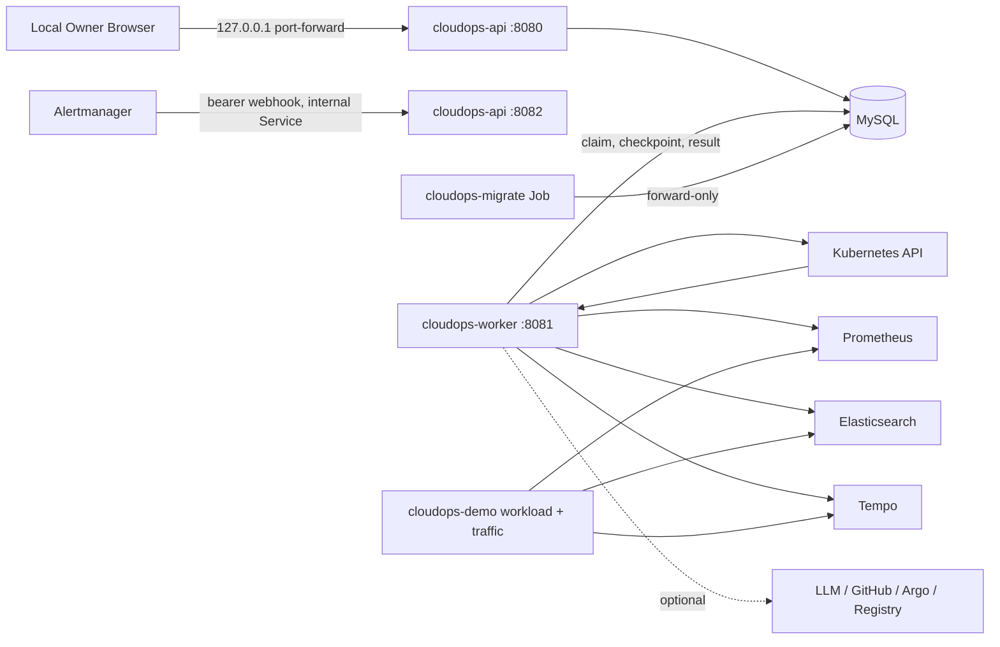

# Architecture

本文描述当前工作树的可运行架构。[实施规范](CloudOps-Implementation-Spec.md) 是产品权威；历史代际设计只保留决策 provenance。

## 1. Runtime topology



唯一部署源是 `charts/cloudops`。本地 release 同时运行 API、Worker、Migrate、MySQL、Prometheus、Alertmanager、Grafana、Elasticsearch、Filebeat、Tempo 与 OTel Collector。Scenario inactive 时不渲染 Scenario runtime；`scenario-up` 只在同一 release 内打开 bounded Scenario。

## 2. Process ownership

### `cloudops-api`

- 提供静态 Vue 应用、`/api/v1`、`/livez`、`/readyz` 与 `/metrics`。
- 在独立内部 listener 提供 `/webhooks/alertmanager`、internal health 与 metrics。
- 组合 Query/Command port，不运行 async claim loop 或 schema migration。
- 用户 Service 不暴露 webhook；API ServiceAccount 不挂载 Kubernetes token。

### `cloudops-worker`

- 从 MySQL `async_tasks` 领取有 operation owner、lease、deadline 与 dedupe identity 的工作。
- 读取 Kubernetes、Metrics、Alerts、Logs、Traces 和已配置 LLM；结果经 bounds、sanitization、source time 与 provider identity 后才可成为 Evidence。
- Kubernetes mutation 仅支持 allowlisted Deployment scale，并同时要求 exact immutable Plan、Owner Authorization、effect-time precondition、Configuration Revision 与 `K8S_WRITE_ENABLED=true`。
- Scenario inactive 时 write gate 为 false，Scenario scale RBAC 不存在。

### `cloudops-migrate`

- 是唯一 schema mutation owner，使用独立 DDL 身份和 release-revision Job。
- 仅应用 embedded forward-only migration；API/Worker 启动不执行 AutoMigrate。

### `cloudops-demo`

- 是本地构建镜像，不是平行产品或启动路径。
- Scenario active 时，同一 Chart 使用它运行 healthy、fault 与 traffic workload；Scenario inactive 时这些资源全部消失。

## 3. Product and browser boundary

浏览器只消费 `/api/v1`。十个 Workspace、详情页、deep link、Back/Forward、Notification Inbox 与 Agent panel 共享相同 Operational Scope 与 Context Link。公开 transport 使用 canonical UUID，隐藏 numeric ID、lease、checkpoint 和 credential。

Local Owner 是固定审计身份。没有 OAuth、login、session、CSRF token 或 localStorage bearer；mutation 仍要求 same-origin/allowlisted `Origin`、bounded `Idempotency-Key`、expected row version，并在 operation/decision 上绑定 exact hash。

## 4. Durable data and projections

MySQL 是 Incident、Alert、Evidence、Agent、Knowledge、Configuration、Operation、Delivery 与 Verification 的 durable truth。关键约束包括：

- public resource 使用 canonical UUID；
- cycle、row version、content hash、owner foreign key 和 dedupe identity 由 schema 强制；
- Evidence 保存 provider、source time、query/context/config revision、schema/content/result hash 与 provenance；
- Agent 保存 actual model、Prompt/Tool Schema hash、tool/model call 与 token usage；
- Operation Authorization 只绑定 immutable material hash，任何 material/config drift 使旧授权失效；
- Scenario runtime 可删除，但 tagged Alert、Context Snapshot、Plan 与相关领域 history 由 retention policy 保留。

## 5. Provider boundary

| Provider | 本地状态 | 权限与 unavailable 行为 |
|---|---|---|
| Kubernetes | enabled read | 固定 cluster/Namespace；Scenario scale 仅在 Scenario active 且 exact authority 生效 |
| Prometheus | enabled | bounded PromQL/catalog，保留 query time 与 source identity |
| Alertmanager | enabled | internal bearer ingress、ack/silence/resolve 审计；无假 Alert |
| Elasticsearch | enabled | bounded query/result/response size；长列表虚拟化 |
| Tempo | enabled | bounded TraceQL/search/detail；resource 与绝对时间窗校验 |
| LLM | configuration dependent | secret write-only；模型只生成 Evidence-bound 建议，不授予 authority |
| GitHub / Argo / Registry | optional external | 未配置/未授权显示 `NOT RUN`；不以 local adapter 或 fixture 补位 |

## 6. Scenario state transition

```text
Live Mode
  -> scenario-up: identity + healthy/fault/traffic runtime + write gate
  -> fault: Kubernetes degradation -> Metrics/Alert/Logs/Trace
  -> Observe -> Investigate -> Plan -> Owner Authorization -> Act -> Verify
  -> recovered: fault replicas 0, Alert resolved, retained ResolutionReport
  -> scenario-down: runtime 0 + write gate false + history retained
  -> Live Mode
```

Scenario identity 在 shell、Scope、Context Snapshot、Evidence 与 operation target 中可见，避免把 Demonstration Scenario 误认为普通 Live Mode。

## 7. Deployment and source boundaries

```text
cmd/cloudops-api        -> internal/bootstrap/api -> router -> internal/api
cmd/cloudops-worker     -> internal/bootstrap -> asyncjob/taskhandler -> providers
cmd/cloudops-migrate    -> internal/bootstrap/migrate -> internal/migration
cmd/cloudops-demo       -> bounded Scenario HTTP/telemetry workload
frontend                -> /api/v1 only
charts/cloudops         -> sole runtime and Scenario render source
scripts/local-lifecycle -> kind + Helm + Scenario + backup/restore/doctor
```

旧 Compose、raw manifests、parallel Chart、`server-monitor` runtime、temporary demo model adapter、GitOps demo contract 和 inactive Workspace UI 已删除。第一方实现名称由 `make check-naming` 保证语义化、无产品代际或 numbered phase identity。

当前运行与验收边界见 [实施状态](evidence/cloudops-implementation-status.md) 和 [Phase 9 最终证据](evidence/phase-9-scenario/final-evidence-report.md)。
