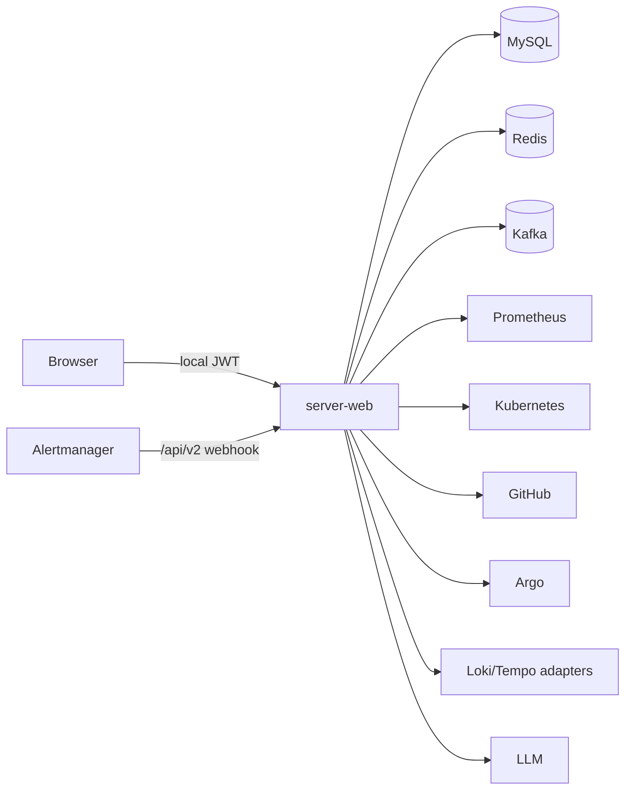
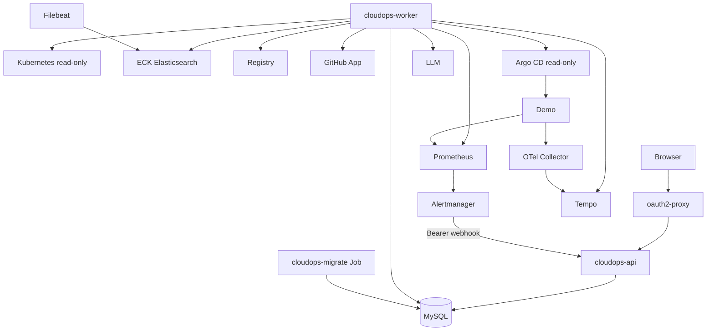

# CloudOps Incident Agent V3 Architecture Baseline

> Status: Phase 0 architecture decision baseline
>
> Normative source: [`CloudOps-Incident-Agent-V3-Refactor-Design.md`](CloudOps-Incident-Agent-V3-Refactor-Design.md)
>
> Audited source baseline: `main@2f7e426d69a4ed7d8d32ec3ca83c13af0c71586e`

## 1. Document Authority

The V3 design is the only normative source for target behavior, boundaries, non-goals and gates. This document records the live V2 baseline and an executable migration classification; it does not replace the design.

Historical V2 specifications, reports, ADRs, README claims, running containers and current code are migration inputs only. They cannot prove that any V3 phase has passed.

## 2. Current Architecture

### 2.1 Repository and modules

```text
CloudOps-Copilot/                         # no tracked root Go module
├── README.md                             # V2-oriented, non-normative
├── .github/workflows/                    # two V2/release workflows
└── server-monitor/
    ├── server-web/                       # module server-web; API + all workers
    │   ├── cmd/migrate/                  # nested Goose CLI
    │   ├── internal/                     # Incident/Agent/Change/Remediation/Verification
    │   └── migrations/00001-00006        # immutable Goose history
    ├── pkg/                              # second Go module
    ├── frontend/                         # Vue V2 Workbench
    ├── charts/server-monitor/            # monolithic V2 chart
    ├── k8s/                              # parallel raw manifests
    ├── docker*/                          # Compose and fast-demo paths
    ├── runbooks/
    └── Makefile
```

The filesystem contains empty root `cmd/`, `internal/` and `migrations/` directories, but Git does not track empty directories. They are not Phase 1 implementation evidence.

### 2.2 Runtime processes

| Current process or entry | Current ownership | V3 mismatch |
|---|---|---|
| `server-web` | Gin user/webhook APIs, static frontend, local auth, Agent loop, Remediation loop, Delivery/Verification loop, health and telemetry | API and Worker responsibilities are mixed; API can initialize K8s and external-write capabilities |
| `server-web/cmd/migrate` | Embedded Goose up/down/status/version CLI | Nested module; not the Helm migration Job; no V3 binary/schema marker contract |
| runtime `AutoMigrate` | Creates/changes local-auth and other legacy GORM tables during `server-web` startup | Runtime schema mutation is forbidden |
| `server-probe` / `alert-service` | No tracked source at HEAD; only empty directories and stale local containers remain | Must not be revived; external leftovers require bounded cleanup later |

Current control flow:



### 2.3 Current durable model

Goose `00001-00006` creates 15 business tables:

```text
incidents
agent_runs
agent_steps
incident_signals
incident_events
evidence_items
outbox_events
incident_correlation_locks
changes
remediation_plans
remediation_approvals
change_requests
verification_runs
verification_checks
postmortems
```

Runtime AutoMigrate separately owns 10 legacy tables/models:

```text
users
host_groups
host_group_members
alert_rules
notification_channels
alert_histories
diagnosis_reports
diagnosis_feedback
pending_actions
audit_logs
```

The current Incident state machine has 11 uppercase states:

```text
DETECTED -> CORRELATING -> DIAGNOSING -> DIAGNOSIS_COMPLETED
         -> PLANNING_REMEDIATION -> AWAITING_APPROVAL
         -> APPLYING_CHANGE -> VERIFYING -> RESOLVED

FAILED and CLOSED_NO_ACTION are additional top-level states.
```

AgentRun, ChangeRequest and VerificationRun each carry an independent lease. `outbox_events` is an append-only domain-event outbox with Add/PendingCount only; it is not a worker queue.

### 2.4 Current delivery and UI

- Docker Compose expands to 14 services.
- Raw Kubernetes and the Helm chart each render 54 resources, creating parallel deployment sources.
- The chart owns `server-web`, Redis, Kafka, MySQL, hand-written Prometheus/Alertmanager/Grafana, VictoriaMetrics, hand-written Elasticsearch/Kibana, Fluent Bit and Jaeger.
- CI has useful pinned actions and static validators, but is scoped to `server-monitor/**`, contains stale package paths and directly deploys the Helm chart with a kubeconfig on tag releases.
- The frontend already has only Incident List and Incident Detail business routes, but uses `/api/v2`, localStorage JWT, 11 V2 states, ten detail sections, live Kubernetes GET and read-only remediation UI.

## 3. Target Architecture

The V3 topology is fixed as:



There is one Incident product flow, one root Go module, three entrypoints, one MySQL-backed async task runtime, one GitOps remediation operation and one kind + Helm deployment path.

## 4. KEEP / ADAPT / DELETE

Decision 列的首个词是当前资产的主决策；斜杠或 `then` 后的词只描述迁移限定或后续生命周期，不创建第四种分类。例如 `KEEP / MIGRATE` 表示先保留能力再迁移位置，`ADAPT then DELETE` 表示先兼容转换、仅在 contract Gate 后删除旧载体。

### 4.1 Source modules and directories

| Current asset | Decision | Target / condition | Phase |
|---|---|---|---|
| `server-monitor/server-web/internal/incident/**` | ADAPT | Preserve transaction, optimistic-lock, correlation-lock and Timeline ideas; add cycle isolation, v2 identity and 7-state workflow | 1-2 |
| `server-monitor/server-web/internal/agent/graph/**` | KEEP / MIGRATE | Eino typed Graph skeleton behind root `internal/investigation`; replace whole-state model exchange with StateDelta | 1, 4 |
| AgentRun/AgentStep/Evidence/checkpoint code | ADAPT | Preserve durable records; add producer/trust/cycle contracts and task-per-step; remove domain lease | 2, 4 |
| `internal/agent/runbook/**` | ADAPT | Keep bounded BM25 search mechanism; retain only Incident-relevant fragments and treat output as guidance | 4 |
| Host-monitoring runbooks | DELETE | Host monitoring is a V3 non-goal; delete after the V3 eval/runbook dataset is frozen | 4/7 |
| `internal/change/**` and GitHub/Argo/Registry read adapters | ADAPT | Build DeploymentContext, exact source/image/GitOps identity and append-only candidate assessments | 3-5 |
| `internal/infra/registryread/**` | KEEP / MIGRATE | Preserve exact digest, OCI revision/source validation, bounded fixed-host reads | 1, 5 |
| `internal/remediation/{patch,hash,policy}.go` | ADAPT | Preserve YAML AST and canonical hash concepts; restrict to `restore_required_env` and bind all approval hashes | 5 |
| `internal/infra/githubwrite/**` | ADAPT | Preserve allowlist and reconciliation ideas; split branch/commit/Draft PR into one-write phases | 5 |
| `internal/verification/**` | ADAPT | Preserve fixed profile/evaluator/stability concepts; add samples, common window, no-change and inconclusive | 6 |
| `server-monitor/pkg/{configutil,health,httpmiddleware,logger,shutdown,tracer}` | KEEP / MIGRATE | Absorb into root `internal/bootstrap`; no internal SDK layer | 1 |
| `server-monitor/pkg` module and `replace` | DELETE | Delete only after all imports build from the root module | 1 |
| `server-monitor/pkg/kafka/**`, `internal/adapter/kafka` concept | DELETE | MySQL `async_tasks` is the only work queue | 1-2/7 |
| `server-monitor/pkg/redis/**`, `internal/infra/redis/**` | DELETE | Remove cache/session/coordination use after callers are migrated | 1-2/7 |
| `internal/compatibility/legacyschema/**` | DELETE | First freeze schema in forward migrations and archive required data; remove after contract Gate | 1/7B |
| `internal/service/auth/**`, local user model | DELETE | Replace with oauth2-proxy + GitHub OAuth; preserve only required audit export | 5/7B |
| `internal/service/alert/**` generic AlertHistory path | DELETE | Alertmanager webhook enters Incident directly | 2/7B |
| `internal/service/fastdemo/**`, `internal/infra/k8schange/**` | DELETE | No direct Kubernetes repair or demo bypass | 5-7A |
| Empty root `cmd/`, `internal/`, `migrations/` directories | DELETE / RECREATE | Do not count them as assets; Phase 1 creates tracked root files from audited code | 1 |

### 4.2 Processes and services

| Current service | Decision | V3 owner | Exit condition |
|---|---|---|---|
| `server-web` HTTP/API | ADAPT | `cloudops-api` | API binary contains no Agent, Delivery or Verification loop and mounts no K8s token |
| `server-web` background loops | ADAPT | `cloudops-worker` | Four bounded queue pools are the only claim path |
| nested migrate CLI | ADAPT | `cloudops-migrate` | Goose + advisory lock + DDL identity + pre-install/pre-upgrade Job |
| embedded Vue static assets | KEEP / MIGRATE | `cloudops-api` | Root `frontend/` build is served by API |
| Redis service | DELETE | none | No runtime import/config/manifest/data dependency |
| Kafka and kafka-init | DELETE | none | No producer/consumer/topic/config/deployment dependency |
| VictoriaMetrics | DELETE | none | Prometheus Operator stack is authoritative for Demo metrics |
| Jaeger | DELETE | Tempo monolithic | Trace query/data path passes Phase 3 |
| Fluent Bit | DELETE | Filebeat Beat CR | ECK/Filebeat path and namespace canary pass |
| Hand-written ES/Kibana | DELETE | ECK resources | Version matrix/data path pass |
| Hand-written Prometheus/Alertmanager/Grafana workloads | DELETE / REPLACE | kube-prometheus-stack | Targets/rules/Alertmanager contract pass |
| Stale local `server-probe` / `alert-service` containers | DELETE | none | Phase 7 cleanup records container/cluster state; Phase 0 does not mutate them |

### 4.3 Tables

| Current table/model | Decision | V3 treatment |
|---|---|---|
| `incidents` | ADAPT | Add cycle, generated active correlation key, blocking fields and deterministic 7-state projection; convert status under cutover lock |
| `incident_signals` | ADAPT | Add cycle, alert instance key, correlation-key version and canonical event identity; preserve append-only rows |
| `incident_events` | KEEP / ADAPT | Preserve append-only audit; add cycle/global event identity and bounded metadata contract |
| `incident_correlation_locks` | KEEP / ADAPT | Use v2 canonical correlation identity and fixed lock order |
| `agent_runs` | ADAPT | Add cycle/outcome/provider/prompt/tool hashes; convert compatible checkpoint; remove lease only in contract migration |
| `agent_steps` | ADAPT | Preserve ordered facts; add StateDelta/action/fact references and producer identity |
| `evidence_items` | ADAPT | Add cycle, producer FK checks, trust axes, claim use, supersedes, provenance and canonical dedupe |
| `outbox_events` | DELETE after archive | Archive by `published_at` and event type; never convert rows directly into work tasks |
| `changes` | ADAPT then DELETE | Backfill immutable `change_candidates`; create append-only `change_candidate_assessments`; delete mutable legacy table at contract |
| `remediation_plans` | ADAPT | Add cycle, operation restriction, immutable complete diff and all approval-bound hashes |
| `remediation_approvals` | ADAPT then archive/delete | Old approvals cannot authorize V3 writes; new immutable records live in `remediation_decisions` |
| `change_requests` | ADAPT | Add cycle, local phase/write phase, exact revisions, event observations and active generated key; remove lease at contract |
| `verification_runs` | ADAPT | Add cycle, trigger identity, profile/hash, no-change and inconclusive; remove lease at contract |
| `verification_checks` | ADAPT | Versioned check specs plus common stability-window projection |
| `postmortems` | DELETE after archive | Preserve ID/content hash/time in `legacy_postmortem_archive`; never backfill as Evidence or ResolutionReport |
| AutoMigrate `users` | DELETE | OAuth replaces local identities; archive only the minimum migration/audit mapping |
| AutoMigrate host/rule/channel/history tables | DELETE | Host monitoring and CRUD are non-goals; export/validate before contract |
| AutoMigrate diagnosis/feedback/pending action tables | DELETE | Never reuse narrative, feedback, pending action or approval as V3 Evidence/Decision |
| AutoMigrate `audit_logs` | ADAPT then archive/delete | Export bounded immutable facts; V3 Timeline/Decision records are authoritative going forward |
| `async_tasks`, `async_task_attempts` | NEW | The only durable work queue and lease owner |
| `signal_rejections`, `command_idempotency_records` | NEW | Bounded rejected-ingress audit and authenticated Command idempotency |
| `deployment_baselines`, `baseline_observations` | NEW | Phase 5 verified last-known-good truth |
| `verification_samples`, `resolution_reports` | NEW | Phase 6 deterministic recovery facts |
| `migration_ledger` and cutover marker | NEW | Expand/backfill/cutover/contract evidence and old-binary refusal |

### 4.4 State machines

| Current | Decision | V3 mapping |
|---|---|---|
| `DETECTED` | ADAPT | `detected` |
| `CORRELATING`, `DIAGNOSING`, `DIAGNOSIS_COMPLETED`, `PLANNING_REMEDIATION` | ADAPT | `investigating` |
| `AWAITING_APPROVAL` | ADAPT | `awaiting_approval` |
| `APPLYING_CHANGE` | ADAPT | `delivering` |
| `VERIFYING` | ADAPT | `verifying` |
| `RESOLVED` | ADAPT | `resolved`; only retain when backed by a compatible passing Verification, otherwise map to investigating + attention |
| `CLOSED_NO_ACTION` | ADAPT | `closed` |
| `FAILED` | DELETE as top-level state | Map by active child priority to verifying/delivering/investigating plus blocking reason |
| AgentRun pending/running/completed/failed/cancelled | KEEP / ADAPT | Lowercase status plus explicit diagnosed/insufficient outcome; task owns lease |
| Plan's delivery/CI statuses | DELETE from Plan | Plan only awaiting/approved/rejected/superseded/cancelled/consumed/invalidated/policy_rejected |
| ChangeRequest's many delivery states | ADAPT | `pending -> pr_open -> merged -> syncing -> rolling_out -> delivered/failed`; observations/reasons stay local |
| VerificationRun without inconclusive | ADAPT | `pending -> running -> passed/failed/inconclusive/timed_out/cancelled` |

### 4.5 Deployment and CI assets

| Current asset | Decision | Target / condition |
|---|---|---|
| `server-monitor/server-web/Dockerfile` | KEEP / ADAPT | Preserve pinned bases, OCI labels, multi-stage and non-root; build V3 entrypoints with exact-SHA evidence |
| `server-monitor/docker-compose.yml` | DELETE | No complete or fast parallel demo path |
| `server-monitor/docker-compose.fast-demo.yml` | DELETE | Golden E2E uses kind + Helm only |
| `server-monitor/k8s/**` | DELETE | No raw parallel deployment source |
| `server-monitor/charts/server-monitor/**` | ADAPT | Move to `charts/cloudops`; manage only API/Worker/Migrate/oauth2-proxy/Service/RBAC/ServiceMonitor/PrometheusRule/config references |
| Chart Redis/Kafka/VM/Jaeger/Fluent Bit/hand-written Elastic templates | DELETE | Replaced/removed as listed above |
| Chart MySQL template | ADAPT ownership | Move to platform bootstrap; CloudOps Chart only references database configuration |
| Chart Secret template and committed placeholder values | DELETE | Reference pre-created Secrets; no credential value in Git/values |
| NodePort/Ingress/HPA defaults | DELETE | Demo uses ClusterIP + port-forward; HA/autoscaling are non-goals |
| `chatops-rbac.yaml` | ADAPT | Worker namespace read Role only; remove pods/log, writes and Node ClusterRole |
| `server-monitor/docker/fast-demo/**` and `scripts/run-v2-demo.sh` | DELETE | No direct scale/patch/fixed-model Golden shortcut |
| `server-monitor/docker/kubeconfig` | DELETE | Ignored local credential; remove during bounded cleanup, never commit/read as V3 evidence |
| `server-monitor/Makefile` | ADAPT | Expose only preflight/demo-up/scenario-open-regression-pr/e2e-gitops/demo-down plus build/test helpers |
| `.github/workflows/ci.yaml` | ADAPT | Root paths and PR_FAST/PR_INTEGRATION/MAIN; remove Compose/raw/direct deploy gates; retain pinned actions, static checks, Trivy/exact-SHA patterns |
| Tag SBOM/Cosign logic | KEEP as optional | Optional release workflow only; never a core V3 Gate |
| `.github/workflows/hosted-supply-chain-validation.yaml` | DELETE / MERGE | Remove dispatch-only parallel path; optional release controls may be absorbed by the tag workflow |
| CI kubeconfig + direct Helm deploy | DELETE | Git is desired state and Argo is the only reconciler |

### 4.6 API, frontend and documentation

| Current asset | Decision | Target / condition |
|---|---|---|
| `/incidents`, `/incidents/:incidentId` routes and one navigation item | KEEP / MIGRATE | Root `frontend/`; only two product pages |
| Incident presentation shells and request cancellation | KEEP / ADAPT | Four V3 detail zones, cursor queries and server-owned state |
| `/api/v2/**` clients and old response envelope | ADAPT | `/api/v3`, `application/problem+json`, public UUID and expected version/hash |
| Local login page, localStorage token and Bearer interceptor | DELETE | oauth2-proxy session; no frontend token storage |
| V2 status badges/types | DELETE / ADAPT | Seven lowercase Incident states and explicit attention/inconclusive/NOT RUN |
| Live `/resources` Workbench GET | DELETE | Persisted Evidence/projection only |
| V2 read-only remediation component | ADAPT | viewer sees complete diff/hashes; operator can Approve/Reject |
| V2 Postmortem DTO/component | ADAPT then DELETE | Deterministic `ResolutionReport` projection |
| SSE polling/reconnect idea | KEEP / ADAPT | Cookie auth, Last-Event-ID and Incident refresh hints only |
| `README.md` V2 claims and broken `doc/**` links | ADAPT | Phase 0 marks non-normative; each implementation phase updates only proven current facts |
| Historical V2 specs/reports/ADRs | DELETE normative status | Keep only as immutable Git/workspace migration input; never restore `doc/` |

## 5. Phase 1 Inputs

Phase 1 is limited to mechanical structure and process boundaries:

1. Create the tracked root module and move code without changing current business/API behavior.
2. Absorb the nested `pkg` module.
3. Create the three entrypoints and remove all background loops from API assembly.
4. Keep the frontend at its current path through the mechanical Go move; Phase 6 moves it to root `frontend/` while performing the already-scoped Workbench adaptation. No separate frontend migration phase is introduced.
5. Replace runtime AutoMigrate with explicit Goose ownership and a dedicated migrate command/Job. Before removal, encode any still-required legacy schema in forward migrations so a fresh database remains readable.
6. Add typed config, process-specific health and graceful shutdown without enabling V3 business paths.

Phase 1 must not compress Incident states, convert leases/outbox, add `/api/v3` behavior, install observability Operators, enable GitHub writes, mutate current external environments or delete legacy data. Those changes belong to their explicit later gates.
