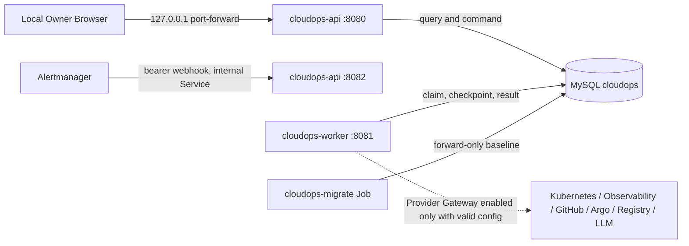

# Architecture

本文描述当前工作树的可运行架构。目标产品与尚未交付能力以 [实施规范](CloudOps-Implementation-Spec.md) 为准；历史代际设计不是当前架构权威。

## 1. 当前拓扑



本地 Chart 默认关闭 Provider Gateway。Worker 仍验证 MySQL 与 async task store readiness，但使用 standby runner，不领取 Provider-backed work。

## 2. 进程所有权

### `cloudops-api`

- 在用户 listener 提供静态 Vue 应用、`/api/v1`、`/livez`、`/readyz` 和 `/metrics`。
- 在独立内部 listener 提供 `/webhooks/alertmanager`、内部 health 和 metrics。
- 只组合 MySQL Query/Command port，不启动 Agent、Delivery、Verification 或 Provider claim loop。
- API ServiceAccount 不挂载 Kubernetes token。

### `cloudops-worker`

- 只从 MySQL `async_tasks` 领取有明确 operation owner 的工作。
- Investigate、Deliver、Observe、Verify 使用隔离 pool、lease、heartbeat、deadline 和 bounded retry。
- Provider Gateway 开启时必须一次性验证完整 Provider identity/config；缺失或非法配置使启动失败。
- Kubernetes access 仅在显式开启时挂载 token，Chart Role 只允许目标 namespace 中的只读资源。

### `cloudops-migrate`

- 是唯一 schema mutation owner。
- 使用独立 MySQL DDL 身份和 release-revision Helm Job。
- 只接受 `up`，应用 embedded forward-only migration 后验证 schema version。
- API 与 Worker 启动时不执行 AutoMigrate。

### `cloudops-demo`

`cloudops-demo` 是受检查的独立构建 target，用于后续 Scenario/验证能力，不属于当前 `local-up` Helm release，也不是平行产品启动路径。

## 3. HTTP 与浏览器边界

浏览器只消费 `/api/v1`。当前前端路由为 Incident list/detail；所有页面刷新和 deep link 由 API 静态 fallback 处理。公开 transport 使用 canonical UUID，隐藏内部 numeric ID、lease、checkpoint 和 credential。

Local Owner 是固定审计身份。没有 OAuth、login、role map、session、CSRF token 或 localStorage bearer。Mutation 仍要求 same-origin/allowlisted `Origin`、`Idempotency-Key`、expected version，并在需要时要求 expected content hash。

## 4. Durable data

`migrations/00001_cloudops_baseline.sql` 是 clean install 的唯一语义基线。它包含 Incident、Signal、Timeline、Agent、Evidence、async task、change/remediation、delivery/verification、baseline 和 import audit 等领域表。

关键约束包括：

- 对外资源使用唯一 canonical UUID。
- cycle、row version、hash 和 owner foreign key 在 MySQL 中强制执行。
- retained Evidence 使用 contract version、fact schema hash、content/result hash、provenance 与 producer identity。
- async task 的 payload/checkpoint schema、lease、attempt 和 dedupe identity 是 durable truth。
- 旧本地数据只通过 backup-first 的一次性转换进入该基线；正常 runtime 不保留 compatibility schema。

API、Worker、Migrate 与 root/bootstrap 使用不同 MySQL 用户和 Secret。Chart render 会拒绝身份复用或 root credential 下放。

## 5. Provider boundary

Provider 是可选能力，不是启动时伪造的数据源：

| Provider | 默认本地状态 | 边界 |
|---|---|---|
| Kubernetes | disabled | 开启后仅目标 namespace read；write 必须保持关闭 |
| Prometheus/Logs/Traces | disabled | 固定 endpoint、timeout、query/result bounds 和 source identity |
| GitHub/Registry/Argo | disabled | read/write identity 分离；外部写必须依赖已批准的精确 operation |
| LLM | disabled | credential 只从 backend secret source 读取；模型没有授权能力 |

Provider unavailable 必须返回或持久化明确 unavailable/failed 事实，不能用 fixture、静态文案或旧 Evidence 填补。

## 6. Kubernetes ownership

唯一部署源是 `charts/cloudops`。`make local-up` 固定创建或复用：

- kind cluster `cloudops-local`；
- namespace `cloudops-system`；
- Helm release `cloudops`；
- Provider namespace `demo`；
- 本地 build/load 的 `cloudops-api`、`cloudops-worker`、`cloudops-migrate` 镜像；
- pinned MySQL 8.0 image 与 persistent volume。

旧 Compose、raw manifest、平行 Chart 和旧服务目录不属于当前 runtime。顶层 Make 是公开生命周期入口，脚本拒绝覆盖上述固定 cluster/context/namespace/release identity。

## 7. Source boundaries

```text
cmd/cloudops-api        -> internal/bootstrap/api -> router/api -> internal/api
cmd/cloudops-worker     -> internal/bootstrap -> asyncjob/taskhandler -> Provider adapters
cmd/cloudops-migrate    -> internal/bootstrap/migrate -> internal/migration -> migrations
frontend                -> /api/v1 only
charts/cloudops         -> API + Worker + Migrate + MySQL runtime
scripts/local-lifecycle -> kind + Helm + backup/restore/doctor
```

第一方实现名称必须通过 `make check-naming`。V1 只出现在明确 public contract 边界；交付编号不进入 package、type、table、config、task、file 或 Kubernetes resource identity。

## 8. 当前边界

Task 0 提供可恢复的语义 runtime 与现有 Incident UI。十 Workspace shell、持久化 Settings、完整 Infrastructure/Observability/Alert/Agent/Verify/DevOps workflow 属于后续任务。完成状态与真实 Browser/Network/Data/Provider/Console 证据只在 [实施状态](evidence/cloudops-implementation-status.md) 中声明。
